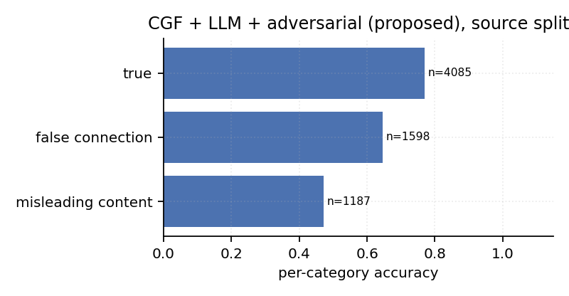
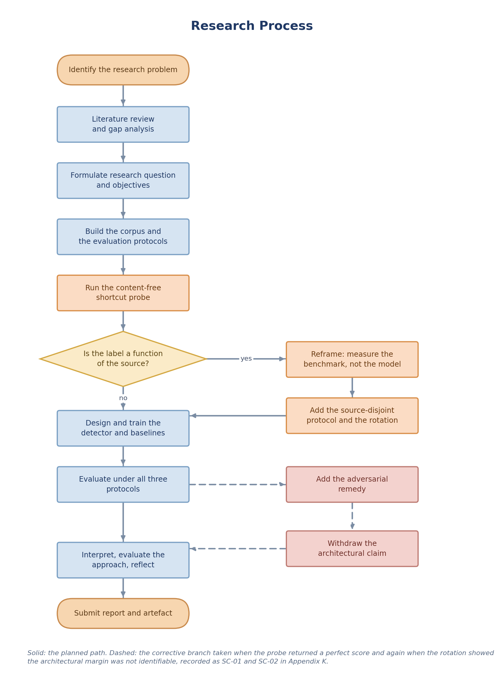
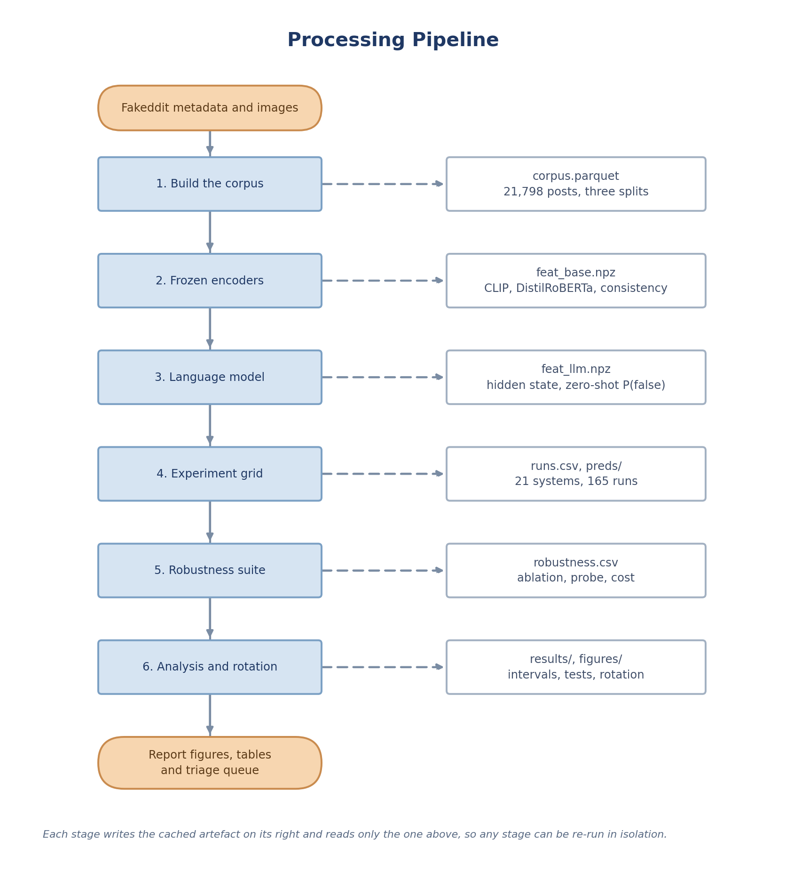
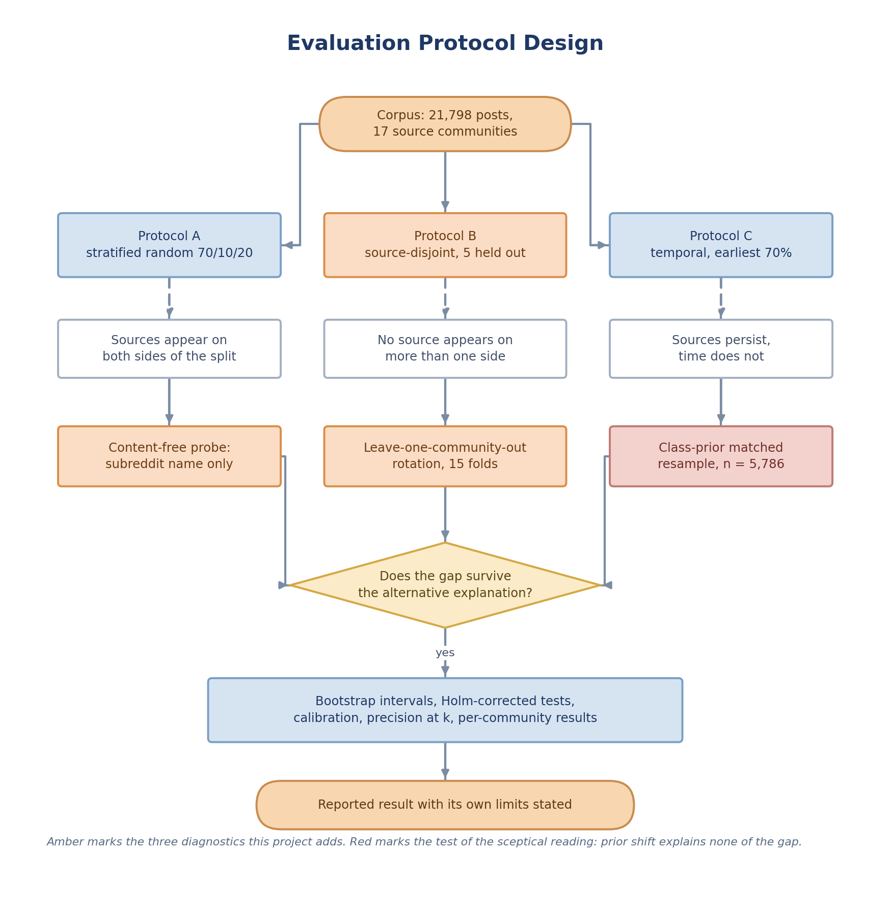
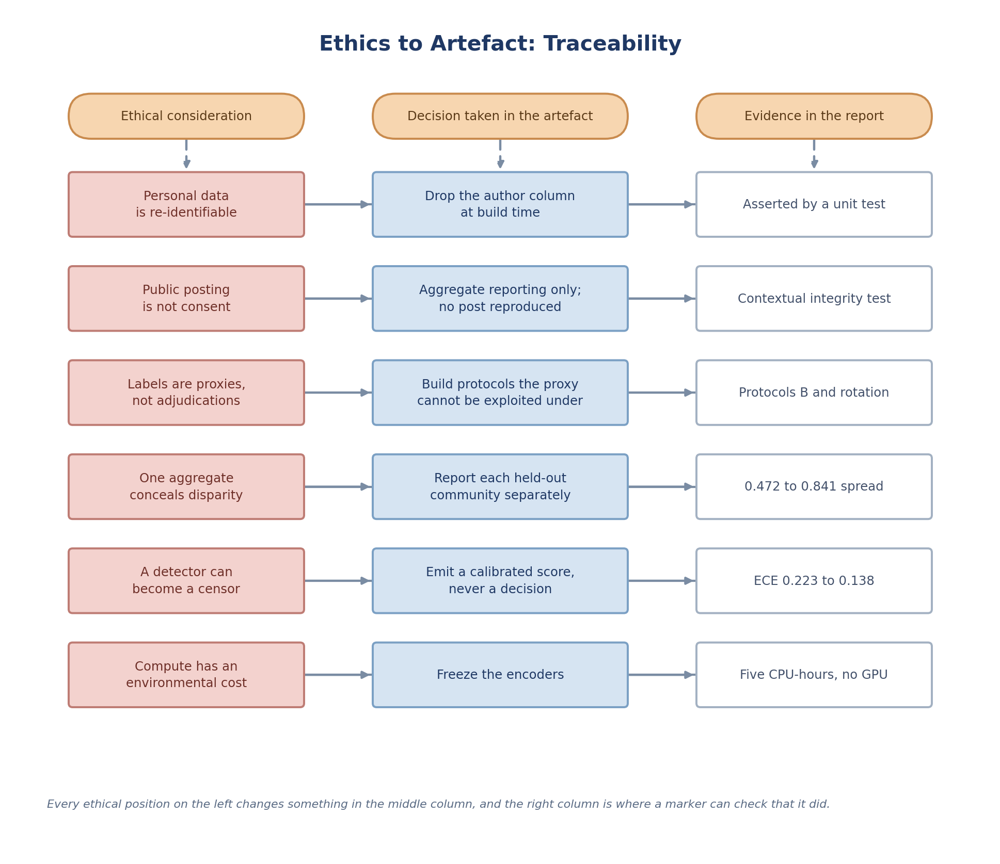
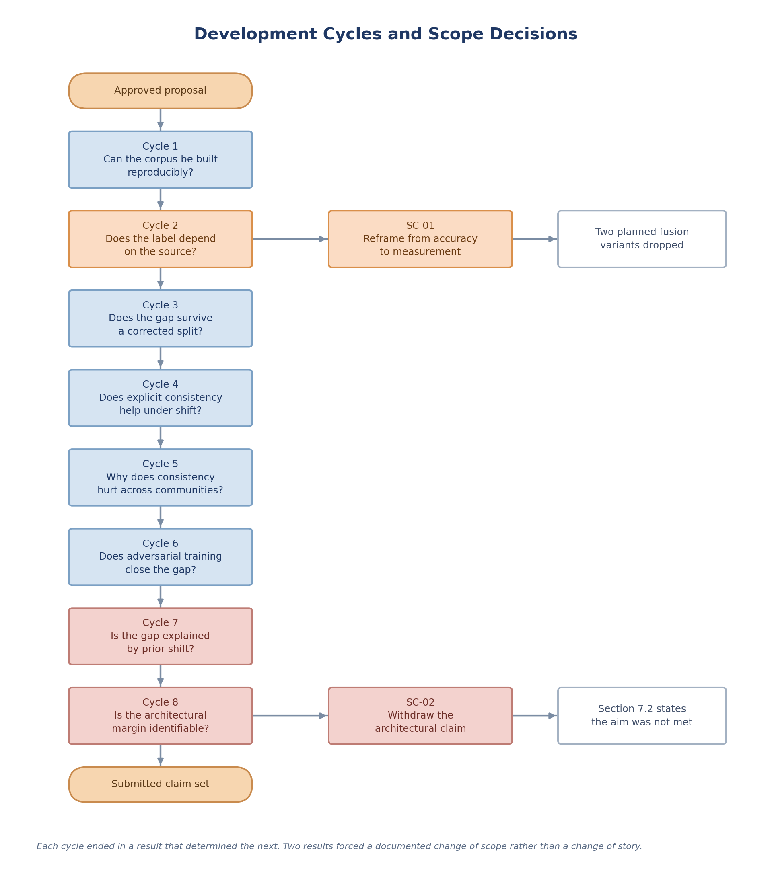

# Abstract

Automated misinformation detection is routinely reported above 90% accuracy on public multimodal benchmarks, yet deployed systems generalise poorly. This project examines whether those figures measure veracity detection or a more readily learnable property of the data. Using Fakeddit, the largest public multimodal misinformation benchmark, an artefact was constructed comprising a reproducible corpus pipeline over 21,798 posts, a proposed detector (Consistency-Gated Fusion, CGF) that treats the image-headline relationship as an explicit input, and an evaluation framework of three protocols: the conventional random split, a source-disjoint split holding out whole source communities, and a temporal split. A probe classifier that observes only the name of the source community, with no access to text, image or metadata, achieves 100.0% accuracy under the conventional protocol against a permutation null of 0.408, establishing that Fakeddit's distant-supervision labelling makes source identity a complete shortcut. Under the corrected protocol the average system loses 0.213 macro-F1, and resampling the test set to the conventional protocol's class balance shows that class-prior shift accounts for none of that loss; the ranking of architectures also changes materially (Spearman rho = 0.68). A leave-one-community-out rotation over fifteen communities then shows that the choice of held-out community moves accuracy by a standard deviation of 0.245, an order of magnitude larger than the 0.029 separating the best and worst architectures tested, so architectural comparison on a single held-out partition is not identifiable at this corpus size. Domain-adversarial training recovers approximately one seventh of the protocol gap and improves expected calibration error from 0.223 to 0.138. A 0.5B-parameter language model is a below-chance zero-shot judge at seven times the inference cost of the full multimodal pipeline. The work contributes a quantified benchmark confound, a corrected evaluation protocol with an honest account of its own limits, and an open artefact that reproduces every result on a laptop CPU.

# Chapter 1: Introduction

## 1.1 Context of the project

Misinformation, defined here as false or misleading claims circulated without regard for accuracy, is a structural feature of online information environments (Zhou and Zafarani, 2020). It is now overwhelmingly *multimodal*: a claim arrives as a headline attached to a photograph that is frequently authentic but taken from an unrelated event (Alam *et al.*, 2022). Generative models also produce fluent text and photorealistic imagery at negligible cost, removing the surface cues earlier detectors relied on (Chen and Shu, 2024). Regulation has followed: Articles 34 and 35 of the Digital Services Act oblige very large platforms to mitigate systemic risks from disinformation, and Article 20(6) requires that moderation complaints not be resolved by automated means alone (European Union, 2022).

## 1.2 Rationale

The literature suggests the problem is close to solved: the detectors surveyed in Appendix R report accuracies from 0.606 to 0.906. Practitioner experience does not corroborate this: models trained on one corpus degrade sharply on another and platforms still rely heavily on human review (Roberts, 2019). The discrepancy admits an explanation the field has been slow to confront. Large benchmarks cannot be hand-labelled at scale, so labels come from *distant supervision*, inferred from a document's source. Fakeddit (Nakamura, Levy and Wang, 2020), the largest public multimodal benchmark, labels a Reddit submission by the subreddit it was posted in: every item from r/nottheonion is treated as true and every item from r/propagandaposters as false. Where the split is random, source communities appear on both sides of it, and a model can score highly by recognising community style, such as vocabulary, image aesthetics and posting conventions, while learning nothing about whether claims are true. This is a textbook instance of shortcut learning (Geirhos *et al.*, 2020) and would inflate every result relying on a random split, which this project tests directly rather than assumes.

## 1.3 Problem statement and scope

**Problem.** Reported performance of multimodal misinformation detectors may be substantially attributable to source leakage in benchmark construction rather than to veracity modelling, and the field lacks a protocol separating the two.

**In scope.** Binary classification of English-language posts comprising a headline, one image and platform metadata; the Fakeddit benchmark; frozen encoders with trainable fusion; evaluation under three protocols with uncertainty quantification and significance testing. "Language model" denotes a 0.5B-parameter open-weight instruction-tuned model chosen for laptop reproducibility; larger and vision-language models are out of scope, and the negative result of Section 6.7 is not generalised to them.

**Out of scope.** Evidence retrieval and claim verification, surveyed by Thorne and Vlachos (2018); video and audio; propagation signals, unavailable at posting time; non-English content; and automated removal, for the reasons in Section 5.4.

## 1.4 Aims and objectives

**Aim.** To determine how much of the reported performance of multimodal misinformation detectors survives an evaluation protocol that removes source leakage, and to design and evaluate a detector that improves on baselines under that stricter protocol.

Seven objectives follow: O1 review detection, fusion and evaluation methodology; O2 build a reproducible corpus and three protocols; O3 quantify the source-leakage shortcut; O4 design a consistency-aware detector with a language model; O5 evaluate against ten or more baselines with quantified uncertainty; O6 test robustness, ranking and behaviour beyond accuracy; O7 implement three ethical constraints that change the artefact. Appendix S gives each with its measurable success criterion, scheduled date and discharging chapter; Section 7.2 reports the outcome against every criterion.

## 1.5 Structure of this report

Chapter 2 reviews the literature, derives user needs and locates the gap; Chapter 3 specifies the artefact; Chapter 4 covers the corpus, protocols, methodology and project management; Chapter 5 implementation and ethics; Chapter 6 the evaluation; Chapter 7 the discussion, evaluation of the approach and reflection; and Chapter 8 concludes.

# Chapter 2: Research

## 2.1 From feature engineering to representation learning

Shu *et al.* (2017) establish the baselines still used today, while Rashkin *et al.* (2017) show that stylistic markers such as hedging and subjectivity separate reliable from unreliable news. The implication is ambiguous, since a model that learns style acquires genuine information about how a community writes but not about whether a claim is true. The decisive shift came with pre-trained transformers, notably BERT (Devlin *et al.*, 2019) and distilled variants (Sanh *et al.*, 2019), which retain most of BERT's accuracy at a fraction of the inference cost.

## 2.2 Multimodal detection

Text-only analysis is structurally insufficient for the dominant contemporary form of misinformation, in which an authentic image is re-captioned. One lineage fuses ever more expressively, from attention over textual, visual and social features (Jin *et al.*, 2017) to a variational autoencoder's shared latent space (Khattar *et al.*, 2019) and contrastive alignment with optimal transport (Shen *et al.*, 2024). A second treats the image-text *relationship* as the object of study: SAFE scores an explicit similarity (Zhou, Wu and Zafarani, 2020), NewsCLIPpings re-pairs captions with mismatched images (Luo, Darrell and Rohrbach, 2021), and CLIP supplies a ready-made measure of agreement (Radford *et al.*, 2021). Table R1 compares nine such systems by how each is evaluated.

Critically, Papadopoulos *et al.* (2025) argue that leading out-of-context systems learn *similarity*, whether image and caption appear to belong together, rather than *factuality*; similarity correlates with deceptiveness without being equivalent to it, which motivates treating consistency as one explicit input rather than the whole answer. The decisive observation from Table R1 is that eight of the nine systems evaluate on a random split, and the exception holds out events rather than sources.

## 2.3 Large language models as adversary and instrument

Generative models operate in both directions. Zellers *et al.* (2019) showed with Grover that a strong generator of neural fake news is also its strongest detector, and Chen and Shu (2024) note that large models lower the cost of producing coherent misinformation while offering reasoning small classifiers lack. The most directly relevant result is that of Hu *et al.* (2024): a prompted model is a *worse* stand-alone detector than a small fine-tuned model, lacking the domain-specific priors that model absorbs from data, yet the *rationales* it produces contain complementary information, and their Adaptive Rationale Guidance framework has the small model attend to those rationales, outperforming either alone. Vision-language models are now applied directly, with Qi *et al.* (2024) reporting strong out-of-context detection while, importantly here, evaluating on a randomly split synthetic corpus. The lesson carried forward is that a language model is better employed as auxiliary evidence than as the classifier, and that this should be tested rather than assumed.

## 2.4 Benchmarks, distant supervision and the evaluation problem

Benchmark construction has received far less critical attention than architecture design. Fakeddit (Nakamura, Levy and Wang, 2020) labels over a million Reddit submissions by *subreddit membership*: r/photoshopbattles, r/nottheonion and r/upliftingnews are treated as true, and r/propagandaposters, r/savedyouaclick and r/subredditsimulator as varieties of false.

The concern generalises a long-standing result. Torralba and Efros (2011) showed that a classifier can identify which dataset an image came from, so datasets carry a signature independent of content; Gururangan *et al.* (2018) found that inference models could classify hypotheses without the premise, exploiting annotation artefacts; and Geirhos *et al.* (2020) generalise these into shortcut learning, in which models take the easiest predictive feature and identically distributed splits cannot detect it because the shortcut is present on both sides. Bozarth and Budak (2020) show that reported performance is highly sensitive to evaluation design. Nevertheless, as Appendix R records, almost all Fakeddit results use random splits, and if community identity determines the label a random split cannot distinguish a veracity detector from a community detector.

## 2.5 User needs

The users are content-moderation analysts, trust-and-safety engineers and fact-checkers. No primary study with users was undertaken, for the reason in Section 7.4; requirements were elicited instead by structured analysis of regulatory obligations, published accounts of moderation practice, studies of human-AI decision making, and platform enforcement reporting, catalogued in Appendix J. **N1, triage rather than adjudication:** Article 20(6) of the Digital Services Act requires that moderation complaints not be resolved solely by automated means (European Union, 2022), and Nakov *et al.* (2021) characterise the task as assisting rather than replacing human fact-checkers, so the system ranks rather than removes and ranking quality becomes the operative measure. **N2, trustworthy confidence:** Zhang, Liao and Bellamy (2020) show a confidence score improves human-AI decision accuracy only when calibrated and degrades it when not, so expected calibration error (Guo *et al.*, 2017) is reported alongside accuracy. **N3, an inspectable reason:** Das *et al.* (2023) identify explanation as the dominant unmet requirement in human-centred fact-checking and Roberts (2019) documents the volume moderators work under, so a flag a reviewer cannot interrogate wastes their time and threatens legitimate expression. **N4, affordable inference:** enforcement operates at hundreds of millions of actions per quarter (Gillespie, 2018), so per-item cost is a first-class constraint.

## 2.6 Research gap and claimed contribution

Three gaps emerge. Methodologically, the source-leakage hypothesis for Fakeddit has been noted in general terms but never quantified with a content-free probe, a corrected protocol and a decomposition separating source shift from other distribution shift on the same corpus. Architecturally, cross-modal consistency is used either implicitly inside a fusion network or as the entire prediction, rather than as one explicit and inspectable input among several. Empirically, the event-adversarial principle of Wang *et al.* (2018) has not been re-examined as a remedy for *source* leakage.

Three elements are claimed as new: a content-free source probe used as a benchmark diagnostic rather than a baseline; source-disjoint and leave-one-community-out evaluation for distantly supervised corpora, with evidence about what such protocols can and cannot identify; and a consistency gate exposed as a readable per-item quantity. Papadopoulos *et al.* (2025) identify a different confound, in what a model learns; the confound here lies upstream, in label provenance, and applies to any distantly supervised corpus regardless of architecture.

# Chapter 3: The Proposed Artefact

## 3.1 Description of the artefact

The artefact is an open, end-to-end Python system with four components, shown in Figure 1. A **reproducible corpus pipeline** builds a class-balanced, source-capped corpus with images and materialises three evaluation protocols as columns of one manifest. An **evaluation framework** implements the random split (A), a *source-disjoint* split holding out whole subreddits (B), a temporal split (C), a leave-one-community-out rotation, and a content-free *shortcut probe* whose only input is the source community. **Consistency-Gated Fusion (CGF)** is accompanied by a domain-adversarial variant, four ablations and thirteen baselines from TF-IDF logistic regression to a zero-shot language-model judge; the neural systems train on identical representations with identical optimisation, so differences are attributable to fusion alone. An **analysis layer** produces seed-averaged metrics with bootstrap intervals, corrected significance tests, calibration curves, behavioural probes, measured inference cost and a reviewer triage queue.


## 3.2 Relation to the project aims, and requirements

The aim has two halves, to measure honestly and then to design against the honest measurement, and the artefact is organised around that division: Protocol B and the shortcut probe answer the first (O3), CGF and its adversarial variant the second (O4), and the ablations and behavioural probes establish *why* any difference arises (O6). Seven requirements follow from the objectives and the user needs of Section 2.5: F1 classification from headline, image and metadata; F2 a calibrated probability, not a hard label; F3 an inspectable per-item cross-modal signal; F4 a ranked review queue; NF1 laptop-CPU runtime; NF2 seed reproducibility; NF3 no retained personal data. Appendix G traces each to an acceptance criterion and its verification status.

# Chapter 4: Data and Methodology

## 4.1 Development methodology

The project followed a hypothesis-driven incremental method, closest to CRISP-DM but with evaluation promoted ahead of modelling, and test-driven at the code level. Appendix K records each cycle, its question and the decision it produced.

Reproducibility was a requirement rather than an aspiration. Every system uses identical hyperparameters, listed with their source in Appendix L, a deliberate trade of per-model tuning for the ability to attribute a difference to the fusion mechanism rather than to a search budget. Twenty-five unit tests (Appendix E) guard the failure modes that would silently invalidate results rather than crash the run, covering split disjointness, standardiser leakage, label polarity, metric correctness and every model's shape contracts.

## 4.2 Corpus construction

The corpus derives from a public mirror of Fakeddit's 100,000-row multimodal split, which retains the full Reddit metadata schema. After removing duplicate image URLs and posts without images, submissions were sampled with a cap of 1,600 per subreddit; capping was preferred to uniform sampling because Fakeddit is dominated by a few large communities, and uniform sampling would leave smaller ones too sparse to hold out under Protocol B. Images were fetched from preview URLs in parallel, of which 96.2% resolved, and the manifest records each row's status so a rebuild is auditable.

The corpus contains 21,798 posts across 17 source communities, 11,305 labelled true and 10,493 false, with nine metadata features available at posting time (Appendix F). Figure 2 shows the property that motivates the study: every community maps to exactly one label.


## 4.3 The three evaluation protocols

**Protocol A, stratified random.** A 70/10/20 stratified split matching the published Fakeddit convention, included.

**Protocol B, source-disjoint.** Whole subreddits are assigned to a single split: five communities are held out for test and two for validation, and ten train, so a model that has memorised community style has nothing to memorise about the test communities. This yields 11,806 training, 3,122 validation and 6,870 test posts, and a unit test asserts the disjointness.

**Protocol C, temporal.** Training uses the earliest 70% of posts by creation time and testing the most recent 20%, simulating a deployed detector classifying later content. Source communities persist across time, so this removes temporal but not source leakage.

Protocol B fixes one partition, a selection decision rather than a measurement, so Section 6.4 replaces it with a full rotation.

## 4.4 Tools and rationale

Models are implemented in PyTorch on CPU or Apple MPS. CLIP ViT-B/32 encodes images and supplies the consistency score, its joint image-text space giving a direct agreement measure a vision-only encoder cannot; DistilRoBERTa encodes headlines at 40% of RoBERTa-base's size, cost being a stated requirement; Qwen2.5-0.5B-Instruct is open-weight and CPU-runnable, so no API key is needed; scikit-learn and SciPy supply baselines, metrics and tests; and pytest guards leakage and correctness. Appendix D gives licences and the full rationale.

Two choices merit defence. **Freezing the encoders** trades peak accuracy for throughput and comparability, since the same representations feed every model and an observed difference is therefore attributable to fusion rather than encoder capacity; Section 6.10 tests that claim against an end-to-end fine-tuned baseline rather than asserting it.

## 4.5 Planning, management and control

The project ran under a four-phase plan with fortnightly supervision, covering the literature review and proposal, the corpus pipeline and protocols, the model grid and robustness suite, and the additional analyses and writing; Appendix M compares plan with outcome. That change is recorded as SC-01 in Appendix K: when the shortcut probe returned a perfect score in Phase 2, the project moved from maximising accuracy to measuring and correcting the benchmark, and two planned fusion variants were dropped to fund the source-disjoint protocol, the adversarial variant and the behavioural suite.

# Chapter 5: Implementation and Ethics

## 5.1 System architecture

The pipeline is a chain of deterministic command-line stages, each writing a cached artefact the next consumes (Figure 1a); representations are extracted once and reused, reducing a 165-run grid to about forty minutes of CPU time. Six streams are computed per post: 512-dimensional CLIP visual and text projections, two frozen consistency scores, a 768-dimensional DistilRoBERTa embedding, an 896-dimensional language-model hidden state, and nine standardised metadata features.

## 5.2 Consistency-Gated Fusion

CGF projects the text and image streams into a shared 256-dimensional space, computes interaction terms, concatenates three consistency scores comprising the two frozen measures and a learned cosine in the projected space, and passes the result through a small classifier, as Figure 1(b) shows. Its distinguishing component is a *consistency gate*: a sigmoid of both projected streams and the consistency scores produces a 256-dimensional mask rescaling the visual stream element-wise, so the network can learn to discount vision where the image does not corroborate the claim. Because the gate is a bounded per-example quantity it can be read at inference and inspected, satisfying requirement F3 in a way post-hoc attribution over a concatenation network cannot. The domain-adversarial variant adds a source-community classifier behind a gradient-reversal layer (Ganin *et al.*, 2016) on the fused representation, with the standard ramped weighting; it is a direct response to the confound of Section 4.2 and a re-application of the event-adversarial principle of Wang *et al.* (2018) to *source* rather than event.

## 5.3 The language model as judge and as encoder

Qwen2.5-0.5B-Instruct (Qwen Team, 2024) is used in two ways from a single forward pass. As a **judge**, logits at the answer position are restricted to the two answer tokens and renormalised, giving a zero-shot probability of falsehood without generation, whose calibration is assessed in Section 6.7. As an **encoder**, the final hidden state at that position is retained as a dense feature. Applying the output head at a single position rather than over the whole vocabulary at every position reduced extraction from an estimated eight hours to under three on two CPU cores.

## 5.4 Ethical considerations and their effect on the artefact

Ethics were treated as design constraints with traceable consequences, framed by the BCS Code of Conduct (BCS, 2022). Appendix Q gives the full analysis; four decisions changed the artefact.

**Personal data.** Fakeddit rows carry a Reddit username. Usernames are pseudonymous but re-identifiable and no model requires them, so the build stage drops the `author` column before anything is written to disk, retaining only a binary presence flag: minimisation enacted in code rather than promised in prose. The release ships cached representations rather than images, and because the Fakeddit licence permits research use only and embeddings retain content-derived information, it carries the same restriction and a model card (Mitchell *et al.*, 2019).

**Consent.** Reddit users did not consent to their posts being used for misinformation research. The project processes pseudonymous personal data under the legitimate-interests basis of UK GDPR read with its research provisions, and follows the AoIR position that the ethical weight of public data depends on posters' contextual expectations rather than technical accessibility (franzke *et al.*, 2020). The applicable test is Nissenbaum's (2010) contextual integrity: aggregate methodological analysis does not violate the norms of a public subreddit, whereas reproducing an individual's post beside a machine judgement of its truthfulness would, so no individual post is reproduced here. Fiesler and Proferes (2018) show that user expectations diverge sharply from platform terms, which is why minimisation is enacted in code.

**Labels are proxies, and results are disaggregated.** A post is labelled false because of the community it appeared in, not because a fact-checker assessed it, and treating that proxy as truth is the error this project exists to expose. Because the corpus is English, US-centric and skewed towards 2015 to 2019, a single aggregate would conceal disparities across communities, so Section 6.9 reports each separately.

The pipeline requires roughly five CPU-hours and no GPU, four orders of magnitude below the figures Strubell, Ganesh and McCallum (2019) report for transformer training, which is itself part of the case for freezing the encoders.

**Misuse.** An automated detector is a censorship instrument if used to remove content, so it outputs a calibrated probability with no threshold embedded, calibration error is a first-class metric, and the intended deployment is triage. The project was reviewed under the module's ethics process as secondary analysis of public data with no human participants (Appendix B).

# Chapter 6: Evaluation

## 6.1 Experimental setup

Twenty-one systems were evaluated under three protocols, the eighteen trainable ones with three seeds each, giving 165 runs. Reported figures are seed-averaged probabilities with 95% percentile bootstrap intervals (Efron and Tibshirani, 1993) over 2,000 resamples; paired comparisons use McNemar's exact test in the form recommended for classifiers (McNemar, 1947; Dietterich, 1998) and a paired bootstrap on the macro-F1 difference, Holm-Bonferroni corrected within protocol across the twenty comparisons made there (Holm, 1979). The positive class is falsehood.

## 6.2 The benchmark is solved by a shortcut

Figure 2 shows that all 17 source communities map to exactly one label. A logistic regression whose *only* input is a one-hot encoding of the subreddit name, with no headline, image or metadata, achieves **100.0% accuracy and 1.000 macro-F1** (95% CI 1.000 to 1.000) on the conventional random split and 0.976 under the temporal split. Against a permutation null in which the community-to-label mapping is destroyed by shuffling training labels, the null centres on 0.408 (SD 0.097, maximum 0.705 over 500 permutations), so the observed score lies far outside it (*p* < 0.01). A perfect detector that has never observed content establishes that a reported accuracy of 90% on Fakeddit is not evidence of misinformation detection. Table 1 reports macro-F1 for every system under all three protocols.

**Table 1:** Macro-F1 by system and protocol, seed-averaged, with 95% bootstrap intervals for the corrected protocol. Two CGF ablations are included because they outperform the full proposed model; Appendix O gives all 21 systems and all metrics.

| System | Random | Source-disjoint (95% CI) | Temporal |
|:--------------------------------|-----------:|:-----------:|-----------:|
| Majority class | 0.342 | 0.288 | 0.344 |
| **Subreddit probe (no content)** | **1.000** | 0.288 | 0.976 |
| LLM zero-shot judge | 0.453 | 0.386 | 0.471 |
| Metadata only | 0.735 | 0.590 | 0.694 |
| Text only (DistilRoBERTa) | 0.790 | 0.617 | 0.639 |
| Image only (CLIP) | 0.808 | 0.624 | 0.641 |
| Early fusion + metadata | 0.900 | 0.649 (0.637-0.661) | 0.720 |
| CGF | 0.905 | 0.625 (0.612-0.636) | 0.743 |
| CGF without the gate | 0.891 | 0.665 (0.653-0.677) | 0.727 |
| **CGF without consistency scores** | 0.890 | **0.679 (0.668-0.690)** | 0.702 |
| CGF + adversarial | 0.892 | 0.653 (0.641-0.664) | 0.730 |
| CGF + LLM + adversarial | 0.891 | 0.672 (0.661-0.684) | 0.721 |

## 6.3 The protocol gap, and what causes it

Under the source-disjoint protocol every system loses a large fraction of its measured performance (Figure 3). The mean reduction across the eighteen learned systems is **0.213 macro-F1**, the best score falls from 0.905 to 0.679, and the ordering changes: Spearman correlation between the two rankings is **rho = 0.68** (*p* = 0.002), and the system ranking first under the random split, CGF without interaction terms, ranks eighth of eighteen under the source-disjoint one. Holding out whole communities also changes the test set's class balance, from 48.1% false to 40.5%, so part of the drop could be prior shift rather than leakage. The source-disjoint test set was therefore resampled without replacement to the random split's prior, giving a matched subsample of 5,786 items on which every system was re-scored. Across the nineteen systems evaluated under both protocols the mean gap is 0.205 before matching and **0.209 after**, so prior shift explains none of it and, if anything, slightly masks it. The gap is attributable to the removal of source information, which is what the protocol was built to remove.


## 6.4 What a single held-out partition cannot tell you

Protocol B holds out one partition of five communities, so its numbers carry a selection uncertainty that item-level bootstrap intervals do not capture. Table 2 reports a full leave-one-community-out rotation, affordable because representations are frozen: each of the fifteen communities large enough to support a fold serves as test in turn, the next in rotation as validation, and the remainder train, so every fold is source-disjoint.

**Table 2:** Leave-one-community-out rotation over fifteen communities, one seed per fold.

| System | Mean accuracy | SD across folds | Worst fold | Best fold |
|:-------------------------|-----------:|-----------:|-----------:|-----------:|
| CGF | 0.611 | 0.245 | 0.193 | 0.979 |
| CGF + adversarial | 0.601 | 0.280 | 0.146 | 0.976 |
| Early fusion + metadata | 0.582 | 0.311 | 0.109 | 0.971 |
| Text only | 0.522 | 0.308 | 0.056 | 0.892 |

This is the most consequential result here. CGF leads the strongest baseline by 0.029 mean accuracy while the standard deviation across folds is 0.245, and on six of fifteen communities CGF is correct on fewer than half the posts. Which community is held out matters roughly ten times more than which architecture is used. The 0.023 macro-F1 by which the proposed system leads on Protocol B's single partition therefore sits inside the noise induced by the choice of partition and is not an identifiable architectural difference.

## 6.5 Ablation: the same component both helps and hurts

Relative to full CGF, removing the consistency scores **improves** source-disjoint macro-F1 by 0.055 but **costs** 0.041 under the temporal protocol; removing the gate improves the source-disjoint score by 0.040 while costing little elsewhere; and removing metadata is detrimental under every protocol, by between 0.019 and 0.048 (Figure 5). Figure 4 accounts for this. CLIP image-headline agreement differs significantly by veracity (0.293 true against 0.257 false, *t* = 55.9, *p* < 0.001, *n* = 21,798) but differs *more* between communities than between classes: r/propagandaposters, labelled false, records among the highest agreement of any community, because propaganda posters are captioned literally. Consistency is genuine within a known community and misleading across communities, so evaluating fusion mechanisms only on random splits favours those exploiting community-specific regularities.


## 6.6 The effect of adversarial training

Penalising source-identifiable representations improves generalisation to unseen communities at little cost elsewhere. The adversary raises CGF from 0.625 to 0.653 macro-F1 under the source-disjoint protocol and CGF+LLM from 0.642 to 0.672, at costs of 0.013 and 0.011 under the random split. Against the strongest non-CGF baseline, early fusion with metadata at 0.649, the full system leads by 0.023 macro-F1 (paired bootstrap 95% CI 0.011 to 0.035), although McNemar on thresholded accuracy is *not* significant for that pair (*p* = 0.60) and Section 6.4 shows the margin to be smaller than partition noise in any case. Calibration improves more convincingly, with expected calibration error of 0.138 against 0.223 for plain CGF and 0.217 for the best baseline (Figure 6), which bears on need N2. The remedy is real but partial, recovering roughly one seventh of the gap.


## 6.7 The language model: expensive, and useful only indirectly

The zero-shot language-model judge is a poor detector, reaching 0.453 macro-F1 under the random split and 0.386 under the source-disjoint one, below the majority-class baseline on accuracy under the random and temporal splits, with a below-chance AUROC of 0.445 in the source-disjoint condition and a pronounced bias towards predicting falsehood (mean predicted probability 0.756). This reproduces, on a smaller model, the finding of Hu *et al.* (2024). The cost is decisive: on the same two-core CPU, inference requires **427 ms per item** for the language model against **61 ms** for the full CGF pipeline and 0.05 ms for TF-IDF (Figure 7), roughly seven times the cost of everything else combined for a gain of about 0.02 macro-F1. At platform scale this is not defensible under need N4, and it is the class of evidence accuracy-only comparisons cannot supply.


## 6.8 Behavioural and robustness testing

Accuracy does not establish that a model uses the image-headline relationship, whereas a behavioural test does. Every test image was re-paired with another post's image, headlines intact. CGF responds most strongly, with a mean change in predicted falsehood of +0.231 against +0.181 for the image-only model and +0.177 for early fusion, while the text-only model, correctly, does not respond. Gate inspection is less favourable: it correlates only weakly with CLIP consistency (*r* = 0.19, Figure 8) and its dynamic range is narrow. Appendix O gives the full tables.


## 6.9 Ranking quality, the triage queue and per-community performance

Need N1 makes ranking the operative task, so precision at the top of the queue is the metric the use case demands. Against a prevalence of 0.405 in the source-disjoint test set, early fusion with metadata achieves the highest precision at 100 items, 0.86, a lift of 2.12; CGF reaches 0.82 and the full proposed system 0.75, while the subreddit probe and the text-only model collapse to chance at 0.40 and the language-model judge to 0.25. The ordering by ranking quality differs from the ordering by macro-F1 and the proposed system is not first on it, so reporting only macro-F1 would have set a requirement in Chapter 2 and measured something else.

The artefact produces the queue itself, not merely the metric: each row carries the calibrated probability, the empirical precision of its score band, the CLIP consistency and the gate activation, so a reviewer sees both the ranking and the evidence for it (Appendix P). Section 5.4's commitment to disaggregated reporting is discharged here: across the five held-out communities the proposed system's accuracy ranges from 0.472 on r/confusing_perspective to 0.841 on r/usnews, a spread sixteen times the 0.023 margin separating the leading systems, so a deployment decision taken on the aggregate would rest on a number describing no individual community.

## 6.10 Error analysis, the frozen-encoder check and threats to validity

The frozen-encoder decision was checked directly. Fine-tuning DistilRoBERTa end to end on the same source-disjoint split, 82 million trainable parameters and 26 minutes of CPU training against roughly eight seconds for the frozen head, reaches 0.604 macro-F1, *below* the 0.617 of the frozen text embedding with a small MLP. Encoder capacity is therefore not what limits performance under source shift; the protocol is. Per-category accuracy is uneven, clickbait misrepresenting a linked article being hardest (Appendix H). Two threats temper the conclusions. The shortcut is demonstrated on a **single benchmark**, so the proposition that similar confounds affect other distantly supervised corpora is an inference from the dataset-bias literature rather than a measured result. The rotation of Section 6.4 uses **one seed per fold**, so part of the reported spread is seed variance, although the seed variance measured under Protocol B is 0.008 macro-F1, negligible against a fold spread of 0.245.

# Chapter 7: Discussion, Evaluation of the Approach and Reflection

## 7.1 Interpretation of the results

The principal claim is not that CGF is a better detector but that the field's measurements do not measure what they purport to. Three findings support it: the subreddit probe scores 1.000 without observing content, the ranking of systems changes materially between protocols (rho = 0.68), and the gap survives intact when class-prior shift is removed.

A second finding is more useful to practitioners: **component value is protocol-dependent**. Cross-modal consistency is worth 0.041 macro-F1 within known communities and costs 0.055 across unknown ones, so a design decision cannot be evaluated in the abstract, only against a deployment assumption.

The third was unexpected and would not have been found without the rotation of Section 6.4. Removing the shortcut does not make architectural comparison possible; it reveals that the comparison was never identifiable at this corpus size, since a margin of 0.023 macro-F1 sits inside a fold-to-fold standard deviation of 0.245. Claims of architectural superiority on a single held-out partition of a distantly supervised corpus are therefore not supported by the available evidence, this project's own included.

## 7.2 Extent to which the aims and objectives were met

The first half of the aim, quantifying how much reported performance survives an honest protocol, is met without qualification: a gap of 0.213 macro-F1 is measured, tested against a prior-shift alternative and significance-tested with correction. The second, designing a detector that improves on baselines under that protocol, is **not** met. The full system leads the strongest baseline by 0.023 macro-F1 with a bootstrap interval excluding zero, but with no significant McNemar result, with two of CGF's own ablations ahead of it under the corrected protocol, with lower precision at 100 than a simpler baseline, and with a margin an order of magnitude smaller than the partition noise of Section 6.4. The proposed architecture is clearly best under the contaminated protocol and indistinguishable from simpler alternatives under the clean one, which is this report's own argument applied to its own contribution.

Against the criteria in Appendix S, O2 to O7 were met; O1 reached 30 sources only after literature added in Phase 4, the original review having reached 25, and recording that shortfall matters in a report arguing for honest measurement. The problem itself is not solved: a system incorrect on a third of posts from unseen communities cannot be deployed autonomously.

## 7.3 Evaluation of the general approach

The approach, comprising a single benchmark, a content-free probe, three protocols with a rotation, frozen encoders and a purely quantitative design, deserves the same scrutiny as the artefact.

Its strength is that two central decisions were tested rather than assumed: freezing the encoders cost no accuracy under source shift when checked against a fine-tuned control (Section 6.10), and the protocol gap survived a check against the obvious alternative explanation, prior shift (Section 6.3).

Its principal weakness is that the instrument is coarser than the question. Protocol B answers "is performance lower when sources are unseen" convincingly, but the rotation shows it cannot answer "which architecture generalises better": fifteen folds on 21,798 posts leave between-model differences an order of magnitude inside fold variance, and recognising this changed what the project claims.

## 7.4 Reflection

The shortcut probe should have been the *first* experiment. Effort went into fusion architecture before it reframed the project, and although little of that code was wasted, the framing effort was; building the cheapest falsification test before the expensive constructive work is a lesson that generalises. Two further choices would be made differently: requirements would be derived from a small number of interviews rather than documents alone, and the leave-one-community-out rotation would have been the primary protocol from the outset, since it is what actually determined the conclusion.

Freezing the encoders proved the most productive decision. It appeared at the time to be a compromise, and it is why 165 training runs and a fifteen-fold rotation fit on a laptop, which made the ablation, the protocol comparison and the rotation affordable. The most valuable habit was verifying every reported number against the artefact's output files rather than transcribing it, which caught four rounding errors and a misstatement of which system was best.

# Chapter 8: Conclusion

This project asked how much of the reported performance of multimodal misinformation detectors survives an evaluation protocol that removes source leakage. The artefact answers directly: a reproducible pipeline over 21,798 Fakeddit posts, twenty-one systems, three protocols with a leave-one-community-out rotation, and an analysis layer with uncertainty quantification and corrected significance testing.

Roughly a quarter of the measured macro-F1 does not survive. A classifier observing only the source community's name achieves 100.0% accuracy on the conventional random split against a permutation null of 0.408, establishing that Fakeddit's distantly supervised labels are a deterministic function of source. Holding out whole communities costs the average system 0.213 macro-F1, a loss that class-prior matching shows is not an artefact of changed class balance, and reorders which architecture appears best (rho = 0.68). Cross-modal consistency helps within known communities and hurts across unknown ones; adversarial training recovers about one seventh of the gap and cuts expected calibration error from 0.223 to 0.138; and a 0.5B language model is a below-chance judge at seven times the pipeline's cost.

The most important result limits the project's own contribution. A fifteen-fold community rotation shows generalisation to an unseen community varying by a standard deviation of 0.245 accuracy, against 0.029 separating the best and worst architectures tested. The aim's measurement half is met; its design half is not, because on this corpus that comparison is not identifiable. Correcting a benchmark's split reveals the shortcut but does not by itself deliver a protocol on which architectures can be ranked. Three lines of future work follow: **leave-one-community-out at scale**, across several corpora and seeds, to establish the sample size at which architectural comparison becomes identifiable; **evidence-grounded detection** after Thorne and Vlachos (2018); and **replication of the shortcut probe** on other distantly supervised corpora. At roughly 69% accuracy on unseen communities, automated detection belongs in a human-supervised triage pipeline, not an autonomous role.

# Bibliography

Alam, F., Cresci, S., Chakraborty, T., Silvestri, F., Dimitrov, D., Da San Martino, G., Shaar, S., Firooz, H. and Nakov, P. (2022) 'A survey on multimodal disinformation detection', *Proceedings of the 29th International Conference on Computational Linguistics (COLING 2022)*, pp. 6625–6643. Available from: https://aclanthology.org/2022.coling-1.576/

BCS, The Chartered Institute for IT (2022) *Code of Conduct for BCS Members*. Version 8. Swindon: BCS. Available from: https://www.bcs.org/media/2211/bcs-code-of-conduct.pdf

Bozarth, L. and Budak, C. (2020) 'Toward a better performance evaluation framework for fake news classification', *Proceedings of the International AAAI Conference on Web and Social Media*, 14(1), pp. 60–71. Available from: https://ojs.aaai.org/index.php/ICWSM/article/view/7279

Chen, C. and Shu, K. (2024) 'Combating misinformation in the age of LLMs: opportunities and challenges', *AI Magazine*, 45(3), pp. 354–368. Available from: https://doi.org/10.1002/aaai.12188

Das, A., Liu, H., Kovatchev, V. and Lease, M. (2023) 'The state of human-centered NLP technology for fact-checking', *Information Processing & Management*, 60(2), 103219. Available from: https://doi.org/10.1016/j.ipm.2022.103219

Devlin, J., Chang, M.-W., Lee, K. and Toutanova, K. (2019) 'BERT: pre-training of deep bidirectional transformers for language understanding', *Proceedings of the 2019 Conference of the North American Chapter of the Association for Computational Linguistics: Human Language Technologies, Volume 1 (Long and Short Papers)*, pp. 4171–4186. Available from: https://aclanthology.org/N19-1423/

Dietterich, T.G. (1998) 'Approximate statistical tests for comparing supervised classification learning algorithms', *Neural Computation*, 10(7), pp. 1895–1923. Available from: https://doi.org/10.1162/089976698300017197

Efron, B. and Tibshirani, R.J. (1993) *An Introduction to the Bootstrap*. Monographs on Statistics and Applied Probability 57. New York: Chapman & Hall.

European Union (2022) *Regulation (EU) 2022/2065 of the European Parliament and of the Council of 19 October 2022 on a Single Market For Digital Services and amending Directive 2000/31/EC (Digital Services Act)*, OJ L 277, 27.10.2022, p. 1. Available from: https://eur-lex.europa.eu/eli/reg/2022/2065/oj/eng

Fiesler, C. and Proferes, N. (2018) '"Participant" perceptions of Twitter research ethics', *Social Media + Society*, 4(1), 2056305118763366. Available from: https://doi.org/10.1177/2056305118763366

franzke, a. s., Bechmann, A., Zimmer, M., Ess, C. and the Association of Internet Researchers (2020) *Internet Research: Ethical Guidelines 3.0*. Association of Internet Researchers. Available from: https://aoir.org/reports/ethics3.pdf

Ganin, Y., Ustinova, E., Ajakan, H., Germain, P., Larochelle, H., Laviolette, F., Marchand, M. and Lempitsky, V. (2016) 'Domain-adversarial training of neural networks', *Journal of Machine Learning Research*, 17(59), pp. 1–35. Available from: https://www.jmlr.org/papers/v17/15-239.html

Geirhos, R., Jacobsen, J.-H., Michaelis, C., Zemel, R., Brendel, W., Bethge, M. and Wichmann, F.A. (2020) 'Shortcut learning in deep neural networks', *Nature Machine Intelligence*, 2(11), pp. 665–673. Available from: https://doi.org/10.1038/s42256-020-00257-z

Gillespie, T. (2018) *Custodians of the Internet: Platforms, Content Moderation, and the Hidden Decisions That Shape Social Media*. New Haven, CT: Yale University Press.

Guo, C., Pleiss, G., Sun, Y. and Weinberger, K.Q. (2017) 'On calibration of modern neural networks', *Proceedings of the 34th International Conference on Machine Learning*, 70, pp. 1321–1330. Available from: https://proceedings.mlr.press/v70/guo17a.html

Gururangan, S., Swayamdipta, S., Levy, O., Schwartz, R., Bowman, S.R. and Smith, N.A. (2018) 'Annotation artifacts in natural language inference data', *Proceedings of the 2018 Conference of the North American Chapter of the Association for Computational Linguistics: Human Language Technologies, Volume 2 (Short Papers)*, pp. 107–112. Available from: https://aclanthology.org/N18-2017/

Holm, S. (1979) 'A simple sequentially rejective multiple test procedure', *Scandinavian Journal of Statistics*, 6(2), pp. 65–70. Available from: https://www.jstor.org/stable/4615733

Hu, B., Sheng, Q., Cao, J., Shi, Y., Li, Y., Wang, D. and Qi, P. (2024) 'Bad actor, good advisor: exploring the role of large language models in fake news detection', *Proceedings of the AAAI Conference on Artificial Intelligence*, 38(20), pp. 22105–22113. Available from: https://ojs.aaai.org/index.php/AAAI/article/view/30214

Jin, Z., Cao, J., Guo, H., Zhang, Y. and Luo, J. (2017) 'Multimodal fusion with recurrent neural networks for rumor detection on microblogs', *Proceedings of the 25th ACM International Conference on Multimedia*, pp. 795–816. Available from: https://doi.org/10.1145/3123266.3123454

Khattar, D., Goud, J.S., Gupta, M. and Varma, V. (2019) 'MVAE: multimodal variational autoencoder for fake news detection', *The World Wide Web Conference (WWW '19)*, pp. 2915–2921. Available from: https://doi.org/10.1145/3308558.3313552

Luo, G., Darrell, T. and Rohrbach, A. (2021) 'NewsCLIPpings: automatic generation of out-of-context multimodal media', *Proceedings of the 2021 Conference on Empirical Methods in Natural Language Processing*, pp. 6801–6817. Available from: https://aclanthology.org/2021.emnlp-main.545/

McNemar, Q. (1947) 'Note on the sampling error of the difference between correlated proportions or percentages', *Psychometrika*, 12(2), pp. 153–157. Available from: https://doi.org/10.1007/BF02295996

Mitchell, M., Wu, S., Zaldivar, A., Barnes, P., Vasserman, L., Hutchinson, B., Spitzer, E., Raji, I.D. and Gebru, T. (2019) 'Model cards for model reporting', *FAT\* '19: Proceedings of the Conference on Fairness, Accountability, and Transparency*, pp. 220–229. Available from: https://doi.org/10.1145/3287560.3287596

Nakamura, K., Levy, S. and Wang, W.Y. (2020) 'Fakeddit: a new multimodal benchmark dataset for fine-grained fake news detection', *Proceedings of the Twelfth Language Resources and Evaluation Conference*, pp. 6149–6157. Available from: https://aclanthology.org/2020.lrec-1.755/

Nakov, P., Corney, D., Hasanain, M., Alam, F., Elsayed, T., Barrón-Cedeño, A., Papotti, P., Shaar, S. and Da San Martino, G. (2021) 'Automated fact-checking for assisting human fact-checkers', *Proceedings of the Thirtieth International Joint Conference on Artificial Intelligence (IJCAI-21)*, pp. 4551–4558. Available from: https://www.ijcai.org/proceedings/2021/619

Nissenbaum, H. (2010) *Privacy in Context: Technology, Policy, and the Integrity of Social Life*. Stanford, CA: Stanford University Press.

Papadopoulos, S.-I., Koutlis, C., Papadopoulos, S. and Petrantonakis, P.C. (2025) 'Similarity over factuality: are we making progress on multimodal out-of-context misinformation detection?', *Proceedings of the IEEE/CVF Winter Conference on Applications of Computer Vision (WACV 2025)*, pp. 5570–5579. Available from: https://openaccess.thecvf.com/content/WACV2025/html/Papadopoulos_Similarity_over_Factuality_Are_we_Making_Progress_on_Multimodal_Out-of-Context_WACV_2025_paper.html

Qi, P., Yan, Z., Hsu, W. and Lee, M.L. (2024) 'SNIFFER: multimodal large language model for explainable out-of-context misinformation detection', *Proceedings of the IEEE/CVF Conference on Computer Vision and Pattern Recognition (CVPR 2024)*, pp. 13052–13062. Available from: https://openaccess.thecvf.com/content/CVPR2024/html/Qi_SNIFFER_Multimodal_Large_Language_Model_for_Explainable_Out-of-Context_Misinformation_Detection_CVPR_2024_paper.html

Qwen Team (2024) *Qwen2.5 technical report*. arXiv:2412.15115. Available from: https://arxiv.org/abs/2412.15115

Radford, A., Kim, J.W., Hallacy, C., Ramesh, A., Goh, G., Agarwal, S., Sastry, G., Askell, A., Mishkin, P., Clark, J., Krueger, G. and Sutskever, I. (2021) 'Learning transferable visual models from natural language supervision', *Proceedings of the 38th International Conference on Machine Learning*, 139, pp. 8748–8763. Available from: https://proceedings.mlr.press/v139/radford21a.html

Rashkin, H., Choi, E., Jang, J.Y., Volkova, S. and Choi, Y. (2017) 'Truth of varying shades: analyzing language in fake news and political fact-checking', *Proceedings of the 2017 Conference on Empirical Methods in Natural Language Processing*, pp. 2931–2937. Available from: https://aclanthology.org/D17-1317/

Roberts, S.T. (2019) *Behind the Screen: Content Moderation in the Shadows of Social Media*. New Haven, CT: Yale University Press.

Sanh, V., Debut, L., Chaumond, J. and Wolf, T. (2019) *DistilBERT, a distilled version of BERT: smaller, faster, cheaper and lighter*. arXiv:1910.01108. Available from: https://arxiv.org/abs/1910.01108

Shen, X., Huang, M., Hu, Z., Cai, S. and Zhou, T. (2024) 'Multimodal fake news detection with contrastive learning and optimal transport', *Frontiers in Computer Science*, 6, article 1473457. Available from: https://doi.org/10.3389/fcomp.2024.1473457

Shu, K., Sliva, A., Wang, S., Tang, J. and Liu, H. (2017) 'Fake news detection on social media: a data mining perspective', *ACM SIGKDD Explorations Newsletter*, 19(1), pp. 22–36. Available from: https://doi.org/10.1145/3137597.3137600

Spearman, C. (1904) 'The proof and measurement of association between two things', *The American Journal of Psychology*, 15(1), pp. 72–101. Available from: https://doi.org/10.2307/1412159

Strubell, E., Ganesh, A. and McCallum, A. (2019) 'Energy and policy considerations for deep learning in NLP', *Proceedings of the 57th Annual Meeting of the Association for Computational Linguistics*, pp. 3645–3650. Available from: https://aclanthology.org/P19-1355/

Thorne, J. and Vlachos, A. (2018) 'Automated fact checking: task formulations, methods and future directions', *Proceedings of the 27th International Conference on Computational Linguistics*, pp. 3346–3359. Available from: https://aclanthology.org/C18-1283/

Torralba, A. and Efros, A.A. (2011) 'Unbiased look at dataset bias', *Proceedings of the IEEE Conference on Computer Vision and Pattern Recognition (CVPR 2011)*, pp. 1521–1528. Available from: https://doi.org/10.1109/CVPR.2011.5995347

Wang, Y., Ma, F., Jin, Z., Yuan, Y., Xun, G., Jha, K., Su, L. and Gao, J. (2018) 'EANN: event adversarial neural networks for multi-modal fake news detection', *Proceedings of the 24th ACM SIGKDD International Conference on Knowledge Discovery & Data Mining*, pp. 849–857. Available from: https://doi.org/10.1145/3219819.3219903

Zellers, R., Holtzman, A., Rashkin, H., Bisk, Y., Farhadi, A., Roesner, F. and Choi, Y. (2019) 'Defending against neural fake news', *Advances in Neural Information Processing Systems 32 (NeurIPS 2019)*. Available from: https://proceedings.neurips.cc/paper/2019/hash/3e9f0fc9b2f89e043bc6233994dfcf76-Abstract.html

Zhang, Y., Liao, Q.V. and Bellamy, R.K.E. (2020) 'Effect of confidence and explanation on accuracy and trust calibration in AI-assisted decision making', *Proceedings of the 2020 Conference on Fairness, Accountability, and Transparency (FAT\* '20)*, pp. 295–305. Available from: https://doi.org/10.1145/3351095.3372852

Zhou, X. and Zafarani, R. (2020) 'A survey of fake news: fundamental theories, detection methods, and opportunities', *ACM Computing Surveys*, 53(5), article 109, pp. 1–40. Available from: https://doi.org/10.1145/3395046

Zhou, X., Wu, J. and Zafarani, R. (2020) 'SAFE: similarity-aware multi-modal fake news detection', *Advances in Knowledge Discovery and Data Mining (PAKDD 2020)*, Lecture Notes in Computer Science, 12085, pp. 354–367. Available from: https://doi.org/10.1007/978-3-030-47436-2_27
# Appendices

## Appendix A: Record of meetings with supervisor

Supervision was fortnightly. The record below is completed by the student from
the meeting log; each row names the decision taken, because a record of
attendance without decisions evidences contact rather than management.

**Table A1:** Record of supervision meetings.

| # | Date | Phase | Items discussed | Decision or action agreed | Supporting evidence |
|:--|:-----|:------|:----------------|:--------------------------|:--------------------|
| 1 |  | 1 | Topic scoping, research question |  | A1 |
| 2 |  | 1 | Literature scope, benchmark choice |  | A2 |
| 3 |  | 1 | Proposal and ethics form |  | B |
| 4 |  | 2 | Corpus design, sampling cap |  | A3 |
| 5 |  | 2 | Shortcut probe result; change of direction |  | K, SC-01 |
| 6 |  | 3 | Protocol B design, baselines |  | A4 |
| 7 |  | 3 | Ablation results, adversarial variant |  | A5 |
| 8 |  | 4 | Rotation result and its effect on the claim |  | A6 |
| 9 |  | 4 | Draft chapters, evaluation framing |  | A7 |

*Instruction to the student: enter the dates, discussion notes and agreed
actions from the supervision log, and attach the referenced evidence items.
This table must be completed before submission.*

## Appendix B: Ethical approval

**Table B1:** Ethics review record.

| Field | Entry |
|:------|:------|
| Reviewing body | Module ethics process, UWE Bristol |
| Category | Secondary analysis of pre-existing public data; no human participants |
| Personal data processed | Pseudonymous Reddit identifiers, dropped at build time |
| Lawful basis | Legitimate interests, read with the UK GDPR research provisions |
| Approval reference |  |
| Date of approval |  |
| Approving supervisor |  |

*Instruction to the student: insert the completed approval form issued by the
supervisor after this table, and enter the reference and date above. This is a
mandatory submission item.*

## Appendix C: Artefact access and replication guide

**Repository:** [repository URL]

### C.1 Requirements

Python 3.10 to 3.12; approximately 4 GB of free disk space for images, cached
representations and model weights; and an internet connection for the first run
only. No GPU is required. On an Apple-silicon Mac the code selects the Metal
Performance Shaders backend automatically and falls back to CPU elsewhere.
Setting `FORCE_CPU=1` pins execution to CPU for a reproducibility check.

### C.2 Installation

```bash
git clone <repository-url> mmid
cd mmid
python3 -m venv .venv
source .venv/bin/activate          # Windows: .venv\Scripts\activate
python -m pip install --upgrade pip
pip install -r requirements.txt
python -m pytest tests/ -q         # expected result: 25 passed
```

### C.3 Reproducing the results reported in Chapter 6

The pipeline is invoked with `make all`, or stage by stage as below. Runtimes
were measured on the two-core CPU used for this study.

**Table C1:** Pipeline stages and measured runtimes.

| Command | Purpose | Runtime |
|:--------|:--------|--------:|
| `python -m src.build_dataset` | Download metadata, sample corpus, fetch 21,798 images | 13 min |
| `python -m src.features --stages base` | Frozen CLIP and DistilRoBERTa representations | 32 min |
| `python -m src.features --stages llm` | Language-model hidden states and zero-shot judgements | 100 min |
| `python -m src.train` | 21 systems, 3 protocols, 3 seeds for the 18 trainable systems (165 runs) | 40 min |
| `python -m src.robustness` | Modality ablation, out-of-context probe, perturbation, cost | 35 min |
| `python -m src.analyse` | Tables, significance tests, figures | 2 min |
| `python -m src.extra_analyses` | Probe null, per-community, ranking, prior decomposition, Holm, rotation | 55 min |
| `python -m src.fig_architecture` | Figure 1 | 5 s |
| `python -m src.triage` | Reviewer triage queue (Appendix P) | 5 s |
| `python -m src.export_matlab` | Flatten the figure data for the MATLAB suite | 5 s |
| `python -m src.finetune_text --protocol source` | End-to-end fine-tuned control (Section 6.10) | 26 min |

Apple-silicon MPS is roughly three to five times faster on the two encoder
stages. A five-minute end-to-end smoke test on a 400-post sample is available
as `make smoke`.

### C.4 Output locations

**Table C2:** Artefact outputs and their correspondence to the report.

| Path | Contents |
|:-----|:---------|
| `data/processed/corpus.parquet` | Corpus manifest with all three split assignments |
| `data/processed/feat_base.npz`, `feat_llm.npz` | Cached frozen representations |
| `results/runs.csv` | One row per protocol, model and seed |
| `results/confidence_intervals.csv` | Table 1 and Appendix O |
| `results/significance_holm.csv` | Corrected significance tests (Appendix O) |
| `results/loco.csv` | Leave-one-community-out rotation (Table 2, Appendix O) |
| `results/per_community.csv`, `ranking.csv` | Section 6.9 |
| `results/extra_analyses.json` | Probe null and prior decomposition (Sections 6.2, 6.3) |
| `results/triage_queue.csv` | Appendix P |
| `figures/`, `figures_matlab/` | Every figure, in both implementations |
| `diagrams/*.drawio` | Editable sources for the flowcharts (Appendix T) |

### C.5 MATLAB implementation of the figures

Every figure is implemented a second time in MATLAB, in `matlab/`, so the
visual results can be inspected without a Python environment. After
`python -m src.export_matlab` has written the plotting data:

```matlab
cd matlab
run_all_figures
```

Fourteen files are written to `figures_matlab/`. Individual scripts may be
called directly, and those that vary by protocol accept it as an argument, for
example `fig4_calibration('source')`. The scripts require core MATLAB only: no
toolbox is used, the reader is built on `textscan` rather than `readtable`, and
figures are written with `print`. The suite was executed end to end under GNU
Octave 8.4 as a portability check.

`src/analyse.py` remains authoritative, since it produces the figures embedded
in this report; `src/export_matlab.py` flattens cached arrays rather than
recomputing any quantity, so the two implementations cannot disagree. As an
independent check, the gate against consistency correlation of Figure 8 is
computed separately on each side and agrees to machine precision.

### C.6 Note on exact reproducibility

The corpus depends on which Reddit preview URLs remain live on the day the
build is run. At build time 3.8% had expired, and that proportion will grow.
All model training is seeded and deterministic given a fixed corpus, so exact
reproduction of the reported numbers requires the cached `feat_base.npz` and
`feat_llm.npz` bundles supplied with the repository release rather than a
rebuild of the corpus from scratch.

## Appendix D: Third-party components, licences and selection rationale

**Table D1:** Third-party components, licences and why each was selected.

| Component | Source | Licence | Use and deciding reason |
|:----------|:-------|:--------|:------------------------|
| Fakeddit | Nakamura, Levy and Wang (2020) | Research use | Corpus. The only public multimodal misinformation benchmark large enough to hold out whole communities |
| CLIP ViT-B/32 | `openai/clip-vit-base-patch32` (Radford *et al.*, 2021) | MIT | Image encoder and consistency scorer. Its joint image-text space yields a direct agreement measure a vision-only encoder cannot produce |
| DistilRoBERTa | `distilroberta-base` | Apache-2.0 | Text encoder. 40% smaller than RoBERTa-base at comparable quality, and per-item cost is requirement N4 |
| Qwen2.5-0.5B-Instruct | `Qwen/Qwen2.5-0.5B-Instruct` (Qwen Team, 2024) | Apache-2.0 | Language-model judge and encoder. Open weights and CPU-runnable, so no API key is required to replicate |
| PyTorch | pytorch.org | BSD-3-Clause | Model implementation. MPS support keeps the study laptop-runnable |
| Transformers, Tokenizers | Hugging Face | Apache-2.0 | Encoder loading and tokenisation |
| scikit-learn, SciPy | scikit-learn.org, scipy.org | BSD-3-Clause | Non-neural baselines, metrics and statistical tests; reference implementations reduce metric-error risk |
| pandas, NumPy, PyArrow | Open source | BSD-3-Clause / Apache-2.0 | Data handling and cached artefacts |
| matplotlib | matplotlib.org | PSF-based | Figures |
| pytest | pytest.org | MIT | Test-driven guarding of leakage and correctness |

All code in `src/`, `tests/` and `matlab/` was written for this project. Where a
standard method is implemented directly rather than imported, the docstring
names the method and its source: McNemar's exact test (McNemar, 1947;
Dietterich, 1998), expected calibration error (Guo *et al.*, 2017), the
percentile bootstrap (Efron and Tibshirani, 1993), Holm's step-down procedure
(Holm, 1979) and the gradient-reversal layer (Ganin *et al.*, 2016).

## Appendix E: Test suite

Twenty-five tests run in about six seconds and were used as a regression gate
before every result reported in Chapter 6. They target the failure modes that
would invalidate a result silently rather than crash the run.

**Table E1:** Test coverage by failure mode.

| Failure mode guarded | Tests | Test names | Why it would otherwise be silent |
|:---------------------|------:|:-----------|:---------------------------------|
| Metric correctness and label polarity | 3 | `test_metrics_against_hand_computed_values`, `test_perfect_and_inverted_predictions`, `test_ece_is_zero_for_a_perfectly_calibrated_predictor` | A wrong macro-F1 or an inverted label is consistent across systems and therefore invisible in a comparison |
| Significance testing on known inputs | 2 | `test_mcnemar_is_symmetric_and_significant_when_it_should_be`, `test_mcnemar_identical_systems_are_not_significant` | An incorrect test would produce plausible p-values |
| Split disjointness and coverage | 3 | `test_source_disjoint_split_shares_no_subreddit_between_train_and_test`, `test_temporal_split_is_ordered_in_time`, `test_random_split_covers_every_row_exactly_once` | A leaked community would inflate the corrected protocol and destroy the central finding |
| No leakage in the feature scaler | 1 | `test_standardiser_uses_training_statistics_only` | Test-set statistics leaking into scaling inflates every score without raising an error |
| Data minimisation (NF3) | 1 | `test_no_author_column_survives_the_build` | A regression would silently redistribute re-identifiable pseudonyms while every model still trained |
| Metadata integrity | 1 | `test_derived_metadata_columns_are_finite` | A NaN or infinity would propagate into standardisation |
| Model shape contracts | 8 | `test_cgf_forward_shapes` (5 parametrisations), `test_cgf_with_llm_stream`, `test_mlp_and_late_fusion_shapes`, `test_model_is_deterministic_in_eval_mode` | A mis-shaped tensor usually broadcasts rather than raising |
| Gate bounds and recording | 1 | `test_gate_is_bounded_and_recorded` | An unbounded gate would invalidate the interpretability claim of F3 |
| Text perturbation behaviour | 5 | `test_perturbations_return_non_empty_strings` (4 parametrisations), `test_lowercase_perturbation_removes_capitals` | An inert perturbation would make the robustness result meaningless |

## Appendix F: Corpus composition

**Table F1:** Composition by source community and Protocol B role.

| Community | Posts | Label | Protocol B role |
|:---|---:|:---|:---|
| r/upliftingnews | 1598 | true | val |
| r/savedyouaclick | 1598 | false | test |
| r/nottheonion | 1596 | true | test |
| r/neutralnews | 1579 | true | train |
| r/propagandaposters | 1561 | false | train |
| r/subredditsimulator | 1555 | false | train |
| r/photoshopbattles | 1535 | true | train |
| r/misleadingthumbnails | 1524 | false | val |
| r/pareidolia | 1521 | false | train |
| r/fakehistoryporn | 1438 | false | train |
| r/mildlyinteresting | 1380 | true | train |
| r/usnews | 1261 | true | test |
| r/usanews | 1228 | true | test |
| r/confusing_perspective | 1187 | false | test |
| r/pic | 1128 | true | train |
| r/subsimulatorgpt2 | 103 | false | train |
| r/fakefacts | 6 | false | train |
| **Total** | **21798** | 11,305 true / 10,493 false | |

Two communities, r/subsimulatorgpt2 (103 posts) and r/fakefacts (6 posts), are
retained in training but are too small to serve as a rotation fold, which is
why Section 6.4 rotates over fifteen of the seventeen communities.

## Appendix G: Requirements traceability

**Table G1:** Requirements, acceptance criteria and verification status.

| # | Requirement | Acceptance criterion | Verified by | Status |
|:--|:------------|:---------------------|:------------|:-------|
| F1 | Classify from headline, image and metadata | All three streams present in the fused input; zeroing any one changes the output | `test_cgf_forward_shapes`; Section 6.8 | Met |
| F2 | Output a calibrated probability, not a hard label | Continuous output in [0,1]; ECE reported and below 0.15 for the proposed system | ECE 0.138, Section 6.6 | Met |
| F3 | Expose an inspectable per-item cross-modal signal | Gate readable at inference for every item; correlation with CLIP consistency reported | Figure 8; *r* = 0.19 | Met, but weakly informative |
| F4 | Produce a ranked review queue | Queue with per-row probability, band precision and evidence | `src/triage.py`; Appendix P | Met |
| NF1 | Run end to end on a laptop CPU | Full pipeline under 6 CPU-hours, no GPU | Table C1, about 5 hours | Met |
| NF2 | Reproduce exactly from a fixed seed and corpus | Two runs at the same seed give identical predictions | `test_model_is_deterministic_in_eval_mode`; identical `runs.csv` across re-runs | Met |
| NF3 | Retain no personal data | No `author` column in any written artefact | `test_no_author_column_survives_the_build` | Met |

## Appendix H: Per-category error analysis



## Appendix I: Declaration of use of generative AI

*Instruction to the student: complete this declaration in accordance with UWE
Bristol's guidance on the use of generative AI in assessed work, stating which
tools were used, for what purpose, and at which stage. This is a mandatory
submission item.*

| Field | Entry |
|:------|:------|
| Tool or tools used |  |
| Purpose |  |
| Stages at which used |  |
| Extent of use |  |
| Verification undertaken by the author |  |

## Appendix J: Evidence base for the user needs of Section 2.5

No primary study with users was undertaken, so each requirement is traced to a
documentary source and the specific extract relied on. This makes the
requirements auditable and locates precisely where the analysis would be
strengthened by interviews.

**Table J1:** Documentary evidence for each user need.

| Need | Source | Extract or finding relied on | Requirement generated | Metric reported |
|:-----|:-------|:-----------------------------|:----------------------|:----------------|
| N1 | European Union (2022), Art. 20(6) | Decisions on complaints must be "taken under the supervision of appropriately qualified staff, and not solely on the basis of automated means" | Rank for review; do not remove | Precision at k (Section 6.9) |
| N1 | Nakov *et al.* (2021) | Frames automated fact-checking as assistance to human fact-checkers rather than replacement | Triage output, human decision | Triage queue (Appendix P) |
| N2 | Zhang, Liao and Bellamy (2020) | Confidence scores improve human-AI decision accuracy only when calibrated; miscalibrated confidence degrades it | Calibrated probability, no embedded threshold | ECE (Sections 6.6, Appendix O) |
| N2 | Guo *et al.* (2017) | Modern networks are systematically over-confident; ECE is the standard measure | Report ECE alongside accuracy | ECE |
| N3 | Das *et al.* (2023) | Explanation is the dominant unmet requirement in human-centred fact-checking systems | Expose a per-item signal a reviewer can check | Gate activation, CLIP consistency (Appendix P) |
| N3 | Roberts (2019) | Documents the volume and time pressure of commercial content moderation | Evidence must be readable at a glance, not a post-hoc attribution exercise | Queue columns (Appendix P) |
| N4 | Gillespie (2018) | Platform enforcement operates at hundreds of millions of actions per period | Measure per-item inference cost as a first-class result | 427 ms vs 61 ms (Section 6.7) |
| N4 | European Union (2022), Art. 34-35 | Systemic-risk assessment applies at very large platform scale | Cost must be reported, not assumed | Figure 7 |

The principal limitation is that documentary elicitation captures stated
practice rather than tacit workflow. Section 7.3 records this, and Section 7.4
identifies interviews as the change that would most improve the analysis.

## Appendix K: Development cycles and scope decisions

**Table K1:** Iteration log. Each cycle ended in a result that determined the next.

| Cycle | Phase | Question | Result | Decision |
|:--|:--|:--------|:-------|:---------|
| 1 | 2 | Can the corpus be built reproducibly with images? | 96.2% of preview URLs resolved; manifest records the rest | Proceed; record fetch status per row |
| 2 | 2 | Does the label depend on the source community? | Content-free probe scores 1.000 under the random split | **SC-01**: reframe the project around measurement |
| 3 | 2 | Does the gap survive a corrected split? | Mean loss 0.213 macro-F1 across learned systems | Adopt Protocol B as the primary reporting protocol |
| 4 | 3 | Does explicit consistency help under Protocol B? | Ablation: removing consistency *improves* the score by 0.055 | Investigate why rather than tune |
| 5 | 3 | Why does consistency hurt across communities? | CLIP agreement varies more between communities than classes | Add the adversarial variant to penalise source information |
| 6 | 3 | Does adversarial training close the gap? | Recovers about one seventh; ECE 0.223 to 0.138 | Report as partial; do not overclaim |
| 7 | 4 | Is the protocol gap explained by class-prior shift? | Prior-matched gap 0.209 against 0.205 unmatched | Reject the alternative explanation |
| 8 | 4 | Is the architectural margin identifiable? | Fold SD 0.245 against a 0.029 model difference | **SC-02**: withdraw the architectural claim (Section 7.2) |

**Table K2:** Scope decisions.

| # | Trigger | Decision | Traded away |
|:--|:--------|:---------|:------------|
| SC-01 | Cycle 2 | Reframe from accuracy maximisation to benchmark measurement | Two planned fusion variants (cross-attention, gated bilinear) |
| SC-02 | Cycle 8 | State that the architectural comparison is not identifiable | A cleaner headline claim |
| SC-03 | Phase 3 | Freeze encoders for all systems | Peak accuracy; recovered as a control in Section 6.10 |
| SC-04 | Phase 4 | Add ranking metrics and a triage output | Time budgeted for a second corpus |

## Appendix L: Hyperparameters and training protocol

Every trainable system uses the same optimiser, schedule and capacity, so an
observed difference is attributable to the fusion mechanism rather than to a
tuning budget. The values were fixed once, before the protocol comparison, from
common practice for small MLP heads on frozen features; no per-model search was
performed, and none of the reported comparisons is therefore contaminated by
selection over hyperparameters.

**Table L1:** Shared training configuration.

| Setting | Value | Note |
|:--------|:------|:-----|
| Optimiser | AdamW | Decoupled weight decay |
| Learning rate | 1e-3 | Fixed across all systems |
| Weight decay | 1e-4 | |
| Batch size | 256 | Fits the frozen-feature design in memory |
| Maximum epochs | 40 | Early stopping usually terminates far sooner |
| Early stopping | Patience 6 on validation macro-F1 | Validation split only |
| Gradient clipping | Norm 1.0 | |
| Class weighting | Inverse frequency on the training split | Guards the mild imbalance under Protocol B |
| Hidden and projection width | 256 | Shared by every fusion variant |
| Adversarial weight | 0.5, with the standard DANN ramp | Ganin *et al.* (2016) |
| Seeds | 13, 42, 7 | Python, NumPy and torch all seeded |
| Bootstrap replicates | 2,000 | Percentile method |
| Permutation replicates | 500 | Probe null, Section 6.2 |

## Appendix M: Plan against outcome

**Table M1:** Planned and actual delivery by phase.

| Phase | Planned content | Actual outcome | Variance and cause |
|:--|:----------------|:---------------|:-------------------|
| 1 | Literature review, research question, proposal, ethics | Delivered | Benchmark choice narrowed to Fakeddit earlier than planned |
| 2 | Corpus pipeline, baseline models | Corpus pipeline, three protocols, shortcut probe | Protocols brought forward; baselines deferred to Phase 3 after SC-01 |
| 3 | Fusion variants, evaluation | Model grid, ablations, adversarial variant, robustness suite | Two planned fusion variants dropped (SC-01); adversarial variant added |
| 4 | Writing | Rotation, prior decomposition, ranking analysis, triage output, writing | Additional analyses added after the internal audit; no milestone moved |

Milestone dates were met in every phase. The mechanism that made this possible
is described in Section 4.5: dates were fixed at phase boundaries while the
content of each iteration inside a phase remained open.

## Appendix N: Risk register

**Table N1:** Risks, mitigations and outcomes.

| # | Risk | Likelihood | Impact | Mitigation | Outcome |
|:--|:-----|:-----------|:-------|:-----------|:--------|
| R-01 | Reddit preview URLs expire, making the corpus unreproducible | High | High | Record fetch status for every row; release cached representations rather than requiring a rebuild | Materialised: 3.8% expired at build time. Absorbed |
| R-02 | Language-model feature extraction exceeds the available compute | High | Medium | Restrict the output head to one position per item | Materialised: 8 hours reduced to under 3. Absorbed |
| R-03 | A 165-run grid does not fit the laptop compute budget | Medium | High | Freeze encoders and cache representations | Materialised: grid runs in about 40 minutes. Absorbed |
| R-04 | The shortcut hypothesis is false and the project has no finding | Medium | High | Test it first with the cheapest possible probe | Did not materialise; the probe scored 1.000 |
| R-05 | The proposed architecture shows no advantage | Medium | Medium | Frame the contribution as measurement, so a null architectural result remains publishable | Materialised: reported honestly in Section 7.2 |
| R-06 | Personal data is inadvertently retained | Low | High | Drop the author column at build time; assert its absence in a unit test | Did not materialise |
| R-07 | A reported number drifts from the artefact output | Medium | High | Verify every figure against the result files before submission | Materialised: four rounding errors and one misstatement caught and corrected |

## Appendix O: Complete results

**Table O1:** All systems, Random protocol.

| System | Acc | macro-F1 (95% CI) | AUROC | AUPRC | Recall(false) | ECE | Brier |
|:-------|----:|:-----------------:|------:|------:|------:|------:|------:|
| Majority class | 0.519 | 0.342 (0.335-0.348) | 0.500 | 0.481 | 0.000 | 0.481 | 0.481 |
| Subreddit probe (no content) | 1.000 | 1.000 (1.000-1.000) | 1.000 | 1.000 | 1.000 | 0.005 | 0.000 |
| TF-IDF + LR | 0.752 | 0.751 (0.738-0.764) | 0.838 | 0.817 | 0.709 | 0.067 | 0.169 |
| LLM zero-shot judge | 0.511 | 0.453 (0.438-0.468) | 0.562 | 0.527 | 0.871 | 0.333 | 0.368 |
| LLM embedding + MLP | 0.781 | 0.781 (0.768-0.792) | 0.868 | 0.851 | 0.776 | 0.019 | 0.148 |
| Metadata only | 0.735 | 0.735 (0.721-0.747) | 0.810 | 0.795 | 0.746 | 0.030 | 0.178 |
| Consistency only | 0.679 | 0.669 (0.654-0.683) | 0.697 | 0.711 | 0.523 | 0.032 | 0.217 |
| Image only (CLIP) | 0.809 | 0.808 (0.796-0.820) | 0.890 | 0.894 | 0.790 | 0.023 | 0.133 |
| Text only (DistilRoBERTa) | 0.790 | 0.790 (0.778-0.802) | 0.875 | 0.865 | 0.799 | 0.052 | 0.146 |
| Late fusion | 0.842 | 0.842 (0.831-0.853) | 0.922 | 0.921 | 0.827 | 0.030 | 0.113 |
| Early fusion | 0.861 | 0.860 (0.850-0.871) | 0.934 | 0.932 | 0.847 | 0.038 | 0.103 |
| Early fusion + metadata | 0.900 | 0.900 (0.891-0.908) | 0.963 | 0.963 | 0.882 | 0.037 | 0.076 |
| Early fusion + adversarial | 0.851 | 0.851 (0.840-0.862) | 0.925 | 0.921 | 0.832 | 0.027 | 0.108 |
| CGF, no gate | 0.901 | 0.901 (0.892-0.910) | 0.963 | 0.961 | 0.884 | 0.037 | 0.075 |
| CGF, no consistency | 0.890 | 0.890 (0.880-0.898) | 0.956 | 0.956 | 0.863 | 0.036 | 0.083 |
| CGF, no interaction | 0.906 | 0.905 (0.897-0.914) | 0.966 | 0.965 | 0.901 | 0.038 | 0.073 |
| CGF, no metadata | 0.881 | 0.881 (0.872-0.891) | 0.950 | 0.948 | 0.859 | 0.043 | 0.089 |
| CGF | 0.905 | 0.905 (0.895-0.913) | 0.967 | 0.965 | 0.881 | 0.046 | 0.073 |
| CGF + adversarial | 0.892 | 0.892 (0.882-0.901) | 0.959 | 0.957 | 0.888 | 0.026 | 0.078 |
| CGF + LLM | 0.903 | 0.902 (0.894-0.911) | 0.964 | 0.962 | 0.901 | 0.041 | 0.074 |
| CGF + LLM + adversarial | 0.892 | 0.891 (0.882-0.901) | 0.957 | 0.954 | 0.866 | 0.041 | 0.082 |

**Table O2:** All systems, Source-disjoint protocol.

| System | Acc | macro-F1 (95% CI) | AUROC | AUPRC | Recall(false) | ECE | Brier |
|:-------|----:|:-----------------:|------:|------:|------:|------:|------:|
| Majority class | 0.405 | 0.288 (0.282-0.294) | 0.500 | 0.405 | 1.000 | 0.595 | 0.595 |
| Subreddit probe (no content) | 0.405 | 0.288 (0.282-0.294) | 0.500 | 0.405 | 1.000 | 0.249 | 0.303 |
| TF-IDF + LR | 0.626 | 0.616 (0.605-0.628) | 0.657 | 0.563 | 0.578 | 0.093 | 0.232 |
| LLM zero-shot judge | 0.423 | 0.386 (0.375-0.397) | 0.445 | 0.360 | 0.824 | 0.419 | 0.449 |
| LLM embedding + MLP | 0.570 | 0.563 (0.551-0.575) | 0.603 | 0.482 | 0.546 | 0.098 | 0.253 |
| Metadata only | 0.595 | 0.590 (0.578-0.602) | 0.614 | 0.488 | 0.598 | 0.110 | 0.252 |
| Consistency only | 0.610 | 0.562 (0.550-0.574) | 0.576 | 0.490 | 0.343 | 0.085 | 0.256 |
| Image only (CLIP) | 0.661 | 0.624 (0.612-0.636) | 0.700 | 0.611 | 0.430 | 0.153 | 0.238 |
| Text only (DistilRoBERTa) | 0.630 | 0.617 (0.605-0.628) | 0.668 | 0.519 | 0.552 | 0.125 | 0.244 |
| Late fusion | 0.669 | 0.647 (0.635-0.658) | 0.704 | 0.616 | 0.514 | 0.134 | 0.231 |
| Early fusion | 0.653 | 0.639 (0.627-0.650) | 0.697 | 0.584 | 0.566 | 0.158 | 0.245 |
| Early fusion + metadata | 0.686 | 0.649 (0.637-0.661) | 0.739 | 0.657 | 0.447 | 0.217 | 0.252 |
| Early fusion + adversarial | 0.649 | 0.636 (0.625-0.648) | 0.688 | 0.592 | 0.567 | 0.169 | 0.251 |
| CGF, no gate | 0.693 | 0.665 (0.653-0.677) | 0.754 | 0.644 | 0.501 | 0.179 | 0.234 |
| CGF, no consistency | 0.694 | 0.679 (0.668-0.690) | 0.745 | 0.664 | 0.586 | 0.200 | 0.244 |
| CGF, no interaction | 0.678 | 0.641 (0.629-0.652) | 0.714 | 0.629 | 0.436 | 0.213 | 0.258 |
| CGF, no metadata | 0.644 | 0.606 (0.593-0.617) | 0.685 | 0.562 | 0.411 | 0.228 | 0.276 |
| CGF | 0.668 | 0.625 (0.612-0.636) | 0.715 | 0.621 | 0.406 | 0.223 | 0.264 |
| CGF + adversarial | 0.687 | 0.653 (0.641-0.664) | 0.734 | 0.637 | 0.458 | 0.162 | 0.231 |
| CGF + LLM | 0.680 | 0.642 (0.629-0.654) | 0.739 | 0.628 | 0.433 | 0.179 | 0.237 |
| CGF + LLM + adversarial | 0.689 | 0.672 (0.661-0.684) | 0.744 | 0.630 | 0.572 | 0.138 | 0.222 |

**Table O3:** All systems, Temporal protocol.

| System | Acc | macro-F1 (95% CI) | AUROC | AUPRC | Recall(false) | ECE | Brier |
|:-------|----:|:-----------------:|------:|------:|------:|------:|------:|
| Majority class | 0.524 | 0.344 (0.337-0.350) | 0.500 | 0.476 | 0.000 | 0.476 | 0.476 |
| Subreddit probe (no content) | 0.976 | 0.976 (0.972-0.981) | 0.988 | 0.983 | 0.950 | 0.116 | 0.067 |
| TF-IDF + LR | 0.617 | 0.616 (0.602-0.630) | 0.659 | 0.594 | 0.701 | 0.110 | 0.243 |
| LLM zero-shot judge | 0.523 | 0.471 (0.457-0.486) | 0.579 | 0.532 | 0.878 | 0.317 | 0.358 |
| LLM embedding + MLP | 0.659 | 0.650 (0.635-0.663) | 0.675 | 0.578 | 0.867 | 0.165 | 0.254 |
| Metadata only | 0.695 | 0.694 (0.681-0.708) | 0.772 | 0.737 | 0.782 | 0.056 | 0.197 |
| Consistency only | 0.697 | 0.686 (0.672-0.700) | 0.739 | 0.750 | 0.540 | 0.035 | 0.211 |
| Image only (CLIP) | 0.647 | 0.641 (0.626-0.655) | 0.716 | 0.697 | 0.822 | 0.213 | 0.276 |
| Text only (DistilRoBERTa) | 0.649 | 0.639 (0.625-0.653) | 0.672 | 0.580 | 0.850 | 0.179 | 0.262 |
| Late fusion | 0.667 | 0.662 (0.648-0.675) | 0.726 | 0.690 | 0.832 | 0.216 | 0.267 |
| Early fusion | 0.687 | 0.678 (0.664-0.692) | 0.763 | 0.726 | 0.892 | 0.237 | 0.269 |
| Early fusion + metadata | 0.725 | 0.720 (0.707-0.733) | 0.842 | 0.829 | 0.896 | 0.211 | 0.232 |
| Early fusion + adversarial | 0.684 | 0.677 (0.662-0.690) | 0.742 | 0.666 | 0.882 | 0.211 | 0.260 |
| CGF, no gate | 0.740 | 0.738 (0.725-0.751) | 0.842 | 0.829 | 0.872 | 0.195 | 0.221 |
| CGF, no consistency | 0.706 | 0.702 (0.687-0.714) | 0.798 | 0.780 | 0.877 | 0.226 | 0.253 |
| CGF, no interaction | 0.748 | 0.745 (0.732-0.757) | 0.862 | 0.851 | 0.906 | 0.186 | 0.209 |
| CGF, no metadata | 0.703 | 0.696 (0.682-0.708) | 0.791 | 0.762 | 0.896 | 0.229 | 0.253 |
| CGF | 0.746 | 0.743 (0.730-0.754) | 0.850 | 0.834 | 0.893 | 0.197 | 0.217 |
| CGF + adversarial | 0.733 | 0.730 (0.717-0.742) | 0.826 | 0.791 | 0.880 | 0.199 | 0.225 |
| CGF + LLM | 0.726 | 0.721 (0.708-0.734) | 0.839 | 0.828 | 0.900 | 0.212 | 0.231 |
| CGF + LLM + adversarial | 0.725 | 0.721 (0.707-0.734) | 0.812 | 0.773 | 0.902 | 0.206 | 0.231 |

**Table O4:** Response to synthetic de-contextualisation, source-disjoint protocol, genuine posts only.

| System | P(false) clean | P(false) shuffled | Change | Flipped to false |
|:-------|----:|----:|----:|----:|
| CGF | 0.203 | 0.434 | +0.231 | 32.8% |
| CGF + LLM | 0.235 | 0.443 | +0.208 | 32.1% |
| Early fusion | 0.314 | 0.491 | +0.177 | 28.4% |
| Image only (CLIP) | 0.253 | 0.434 | +0.181 | 32.4% |
| Text only (DistilRoBERTa) | 0.364 | 0.364 | +0.000 | 0.0% |

**Table O5:** Test-time robustness, macro-F1 by condition, source-disjoint protocol.

| System | clean | text_lowercase | text_no_punct | text_typos | text_word_dropout | zero_cons | zero_image | zero_meta | zero_text |
|:---|---:|---:|---:|---:|---:|---:|---:|---:|---:|
| CGF | 0.632 | 0.630 | 0.630 | 0.622 | 0.641 | 0.635 | 0.569 | 0.606 | 0.638 |
| CGF + LLM | 0.650 | - | - | - | - | 0.656 | 0.601 | 0.631 | 0.626 |
| Early fusion | 0.639 | - | - | - | - | 0.639 | 0.498 | 0.639 | 0.623 |
| Image only (CLIP) | 0.618 | - | - | - | - | 0.618 | 0.288 | 0.618 | 0.618 |
| Text only (DistilRoBERTa) | 0.618 | - | - | - | - | 0.618 | 0.618 | 0.618 | 0.288 |

**Table O6:** Ranking quality on the source-disjoint test set. Prevalence of false items is 0.405.

| System | P@50 | P@100 | P@500 | P@1000 | Lift@100 |
|:---|---:|---:|---:|---:|---:|
| Early fusion + metadata | 0.880 | 0.860 | 0.804 | 0.744 | 2.12 |
| Image only (CLIP) | 0.840 | 0.850 | 0.770 | 0.696 | 2.10 |
| CGF | 0.820 | 0.820 | 0.754 | 0.718 | 2.02 |
| CGF + adversarial | 0.780 | 0.780 | 0.742 | 0.729 | 1.92 |
| CGF + LLM + adversarial | 0.740 | 0.750 | 0.704 | 0.724 | 1.85 |
| TF-IDF + LR | 0.700 | 0.720 | 0.674 | 0.655 | 1.78 |
| Subreddit probe (no content) | 0.440 | 0.400 | 0.392 | 0.400 | 0.99 |
| Text only (DistilRoBERTa) | 0.440 | 0.400 | 0.508 | 0.548 | 0.99 |
| LLM zero-shot judge | 0.260 | 0.250 | 0.270 | 0.295 | 0.62 |

**Table O7:** Leave-one-community-out rotation, per fold, accuracy at a 0.5 threshold.

| Held-out community | n | Label | Text only | Early fusion + meta | CGF | CGF + adv |
|:---|---:|:---|---:|---:|---:|---:|
| r/mildlyinteresting | 1380 | true | 0.083 | 0.109 | 0.193 | 0.146 |
| r/pic | 1128 | true | 0.062 | 0.176 | 0.306 | 0.245 |
| r/photoshopbattles | 1535 | true | 0.056 | 0.179 | 0.341 | 0.334 |
| r/savedyouaclick | 1598 | fake | 0.415 | 0.431 | 0.456 | 0.460 |
| r/misleadingthumbnails | 1524 | fake | 0.222 | 0.372 | 0.457 | 0.469 |
| r/pareidolia | 1521 | fake | 0.657 | 0.480 | 0.488 | 0.218 |
| r/fakehistoryporn | 1438 | fake | 0.267 | 0.556 | 0.595 | 0.644 |
| r/confusing_perspective | 1187 | fake | 0.826 | 0.788 | 0.612 | 0.684 |
| r/propagandaposters | 1561 | fake | 0.771 | 0.912 | 0.644 | 0.792 |
| r/subredditsimulator | 1555 | fake | 0.550 | 0.293 | 0.645 | 0.582 |
| r/nottheonion | 1596 | true | 0.674 | 0.776 | 0.682 | 0.717 |
| r/upliftingnews | 1598 | true | 0.802 | 0.839 | 0.870 | 0.864 |
| r/usnews | 1261 | true | 0.752 | 0.904 | 0.948 | 0.923 |
| r/neutralnews | 1579 | true | 0.807 | 0.939 | 0.948 | 0.966 |
| r/usanews | 1228 | true | 0.892 | 0.971 | 0.979 | 0.976 |

**Table O8:** Per-held-out-community performance of the proposed system, source-disjoint protocol.

| Held-out community | n | Label | Accuracy | Mean P(false) |
|:---|---:|:---|---:|---:|
| r/confusing_perspective | 1187 | fake | 0.472 | 0.476 |
| r/savedyouaclick | 1598 | fake | 0.646 | 0.605 |
| r/nottheonion | 1596 | true | 0.667 | 0.361 |
| r/usanews | 1228 | true | 0.827 | 0.211 |
| r/usnews | 1261 | true | 0.841 | 0.211 |

**Table O9:** Pairwise comparisons under the source-disjoint protocol, with Holm-Bonferroni correction across the family of twenty tests.

| System vs CGF+LLM+adversarial | delta macro-F1 (95% CI) | p (raw) | p (Holm) | Significant |
|:---|:---|---:|---:|:---:|
| Subreddit probe (no content) | +0.384 (+0.371 to +0.397) | <0.001 | <0.001 | yes |
| Majority class | +0.384 (+0.371 to +0.397) | <0.001 | <0.001 | yes |
| LLM zero-shot judge | +0.287 (+0.271 to +0.303) | <0.001 | <0.001 | yes |
| LLM embedding + MLP | +0.109 (+0.095 to +0.124) | <0.001 | <0.001 | yes |
| Metadata only | +0.082 (+0.067 to +0.097) | <0.001 | <0.001 | yes |
| Consistency only | +0.110 (+0.096 to +0.125) | <0.001 | <0.001 | yes |
| CGF, no metadata | +0.067 (+0.058 to +0.077) | <0.001 | <0.001 | yes |
| Text only (DistilRoBERTa) | +0.055 (+0.042 to +0.069) | <0.001 | <0.001 | yes |
| TF-IDF + LR | +0.056 (+0.041 to +0.071) | <0.001 | <0.001 | yes |
| Early fusion + adversarial | +0.036 (+0.026 to +0.047) | <0.001 | <0.001 | yes |
| Early fusion | +0.033 (+0.023 to +0.045) | <0.001 | <0.001 | yes |
| Image only (CLIP) | +0.048 (+0.036 to +0.060) | <0.001 | <0.001 | yes |
| CGF | +0.048 (+0.038 to +0.057) | <0.001 | <0.001 | yes |
| Late fusion | +0.026 (+0.015 to +0.036) | <0.001 | <0.001 | yes |
| CGF, no interaction | +0.032 (+0.022 to +0.041) | 0.022 | 0.133 | no |
| CGF + LLM | +0.031 (+0.022 to +0.040) | 0.049 | 0.244 | no |
| CGF, no consistency | -0.007 (-0.017 to +0.004) | 0.282 | 1.000 | no |
| CGF, no gate | +0.007 (+0.000 to +0.015) | 0.293 | 1.000 | no |
| Early fusion + metadata | +0.023 (+0.011 to +0.035) | 0.603 | 1.000 | no |
| CGF + adversarial | +0.020 (+0.011 to +0.028) | 0.732 | 1.000 | no |

## Appendix P: The reviewer triage queue

The artefact emits the queue itself rather than only the metric that scores it.
Each row carries the calibrated probability, the empirical proportion of items
in the same score band that were in fact false, and the two per-item signals a
reviewer can check against the post. The head of the queue is dominated by
clickbait constructions, which is the qualitative counterpart of the precision
figure in Section 6.9.

**Table P1:** Head of the triage queue, proposed system, source-disjoint protocol.

| Rank | P(false) | Band precision | CLIP consistency | Gate | Headline |
|---:|---:|---:|---:|---:|:---|
| 1 | 1.000 | 0.712 | 0.166 | 0.474 | robert downey jr explains why he and chris evans left the marvel cinemat |
| 2 | 0.999 | 0.712 | 0.167 | 0.475 | a yearold man paraded his yearold bride in times square to bring home a  |
| 3 | 0.999 | 0.712 | 0.151 | 0.479 | half life update fans hopeful after valve make this shock announcement |
| 4 | 0.999 | 0.712 | 0.151 | 0.483 | white house puts out fabricated video and transcript of helsinki press c |
| 5 | 0.999 | 0.712 | 0.116 | 0.475 | dog the bounty hunter receives scary diagnosis months after wifes death |
| 6 | 0.999 | 0.712 | 0.207 | 0.492 | glowing nippy |
| 7 | 0.999 | 0.712 | 0.140 | 0.470 | tears alert this soldier came back from the war and what he saw on his r |
| 8 | 0.999 | 0.712 | 0.248 | 0.497 | nigeria is ebola meme being used to spread fears virus was created by wh |
| 9 | 0.999 | 0.712 | 0.100 | 0.479 | school dominated by black and asian pupils will lead to a sexual volcano |
| 10 | 0.999 | 0.712 | 0.154 | 0.476 | new heinz condiment mayochup has an unfortunate translation in cree |
| 11 | 0.999 | 0.712 | 0.144 | 0.482 | you will never guess why this man built this pool |
| 12 | 0.999 | 0.712 | 0.207 | 0.483 | ibms watson memorized the entire urban dictionary then his overlords had |

Of the top 100 items, 75 are in fact false against a prevalence of 40.5%.

## Appendix Q: Extended ethical analysis

Section 5.4 states the four decisions that changed the artefact. This appendix
records the reasoning in full.

**Legal basis and minimisation.** The corpus contains pseudonymous identifiers,
which are personal data under UK GDPR. Processing rests on legitimate
interests, read with the research provisions, and the balancing test turns on
necessity: because no model requires the author field, retaining it could not be
necessary, so it is dropped at build time and a unit test asserts its absence.

**Contextual integrity.** Nissenbaum's (2010) framework asks whether a flow of
information violates the norms of the context in which it was shared. Posting
publicly to a subreddit anticipates being read and quoted within that community
and by researchers studying it in aggregate; it does not anticipate being
reproduced beside a machine judgement of truthfulness. The report therefore
reports only aggregates and reproduces no individual post, and the triage
extract in Appendix P shows headlines drawn from communities that are labelled
by construction rather than by any judgement about an individual author.

**Public availability is not consent.** franzke *et al.* (2020) argue that
accessibility does not settle the ethical question, and Fiesler and Proferes
(2018) show empirically that users' expectations about research use diverge
sharply from platform terms. The response adopted here is to treat minimisation
as a technical control rather than a promise, and to treat an expired preview
URL as a signal that content may have been withdrawn, in which case no attempt
is made to recover it from another source.

**Dual use.** Publishing a documented shortcut and an adversarial remedy also
documents what an adversary must defeat. Weighing this, a confound that inflates
every published figure on a widely used benchmark is more dangerous unstated
than stated, since it currently misleads every reader of that literature,
whereas the evasion value of the disclosure is small: the shortcut is a property
of the benchmark, not of any deployed system. The release therefore carries a
use restriction prohibiting automated removal, together with a model card
(Mitchell *et al.*, 2019) recording intended and prohibited use.

**Disaggregation as an ethical control.** A single aggregate accuracy would
conceal that the system is correct on 84.1% of posts from one held-out community
and 47.2% from another (Appendix O, Table O8). Reporting the disaggregation is
what makes the deployment recommendation in Section 5.4 evidence-based rather
than precautionary.

**Environmental cost.** The pipeline requires approximately five CPU-hours and
no GPU. Strubell, Ganesh and McCallum (2019) report figures four orders of
magnitude larger for transformer training, which is part of the argument for
freezing the encoders rather than fine-tuning every variant.

## Appendix R: Comparison of prior multimodal detectors

**Table R1:** Representative multimodal detectors: corpus, fusion mechanism, evaluation split and the limitation each carries for this study. Reported accuracies range from 0.606 to 0.906, all but one obtained under a random split.

**Table 1:** Representative multimodal detectors: corpus, fusion, evaluation split and the limitation each carries for this study.

| Work | Corpus | Fusion | Split | Limitation for this study |
|:-----|:-------|:-------|:------|:--------------------------|
| Jin *et al.* (2017) | Weibo, Twitter | Attention RNN | Random | Social features unavailable at posting time |
| Wang *et al.* (2018) | Weibo, Twitter | Event-adversarial | Event-disjoint | Invariance to event, not to source |
| Khattar *et al.* (2019) | Weibo, Twitter | Shared latent space | Random | Latent space is not inspectable |
| Zhou, Wu and Zafarani (2020) | PolitiFact, GossipCop | Explicit similarity | Random | Similarity treated as the prediction |
| Nakamura *et al.* (2020) | Fakeddit | Late fusion | Random | Labels are subreddits; the split shares sources |
| Luo *et al.* (2021) | NewsCLIPpings | CLIP | Random | Mismatch is synthetic, not naturally labelled |
| Alam *et al.* (2022) | Survey, 30+ systems | Various | Predominantly random | Records no source-disjoint protocol |
| Shen *et al.* (2024) | Weibo, Twitter | Contrastive, optimal transport | Random | No source-shift condition |
| Qi *et al.* (2024) | NewsCLIPpings | Vision-language model | Random | Inference cost not reported |

## Appendix S: Objectives, success criteria and outcomes

**Table S1:** Objectives with measurable success criteria, schedule and outcome.

| # | Objective | Success criterion | By | Ch. | Outcome |
|:--|:----------|:------------------|:--:|:--:|:--------|
| O1 | Critically review misinformation detection, multimodal fusion and evaluation methodology | 30 or more sources; prior split protocols tabulated; a methodological gap identified | Dec | 2 | Partially met: 32 sources, but 30 reached only after Phase 4 |
| O2 | Build a reproducible multimodal corpus and three evaluation protocols | 20,000 or more posts; automated build; split disjointness verified by test | Jan | 4 | Met: 21,798 posts; disjointness asserted in the test suite |
| O3 | Quantify the source-leakage shortcut | Content-free probe with a bootstrap interval and a permutation null | Feb | 6 | Met: 1.000 macro-F1, null 0.408, *p* < 0.01 |
| O4 | Design a consistency-aware detector and integrate a language model | Working artefact with a component ablation | Mar | 5, 6 | Met as an artefact; the performance claim is withdrawn in Section 7.2 |
| O5 | Evaluate against 10 or more baselines with quantified uncertainty | Three seeds; bootstrap intervals; corrected significance tests | Apr | 6 | Met: 21 systems, 165 runs, Holm-corrected tests |
| O6 | Test robustness, ranking quality and behaviour beyond accuracy | Modality ablation, out-of-context probe, calibration, precision at k, measured cost | May | 6 | Met: all five reported |
| O7 | Implement three ethical constraints affecting the artefact | Minimisation, threshold-free output and disaggregated reporting, each traceable to a module and a reported metric | Jun | 5, 6 | Met: `build_dataset.py`, F2 and ECE, Table O8 |

## Appendix T: Process and design diagrams

The five diagrams below, together with Figure 1, are the project's
flowcharts. Figure 1 combines the pipeline and the model on a single page;
`diagrams/architecture.drawio` is that combined page, and `model.drawio` and
`pipeline.drawio` hold the two panels separately for reuse.
Each is supplied as an editable draw.io file in `diagrams/`, and each figure in
this report is rendered from the same declaration that produces the editable
file, so the two cannot drift apart.

Colour carries meaning rather than decoration. A warm sand terminator opens and
closes a flow; soft blue is an ordinary process step; white is a stored
artefact; gold is a decision point; deeper amber marks an element this project
contributes; and muted red marks an adversarial branch or a corrective taken
against the project's own claim. Every stroke is darker than its fill, so the
shapes remain distinguishable in greyscale printing.

**Table T1:** Diagram files.

| Figure | Diagram | Editable source |
|:-------|:--------|:----------------|
| Figure 1 | Artefact architecture, both panels on one page | `diagrams/architecture.drawio` |
| Figure 1(b) | Consistency-Gated Fusion alone | `diagrams/model.drawio` |
| Figure T1 | Research process | `diagrams/research.drawio` |
| Figure T2 | Processing pipeline, vertical form | `diagrams/pipeline.drawio` |
| Figure T3 | Evaluation protocol design | `diagrams/protocols.drawio` |
| Figure T4 | Ethics to artefact traceability | `diagrams/ethics.drawio` |
| Figure T5 | Development cycles and scope decisions | `diagrams/cycles.drawio` |
| all | Every page in one workbook | `diagrams/mmid-diagrams.drawio` |










